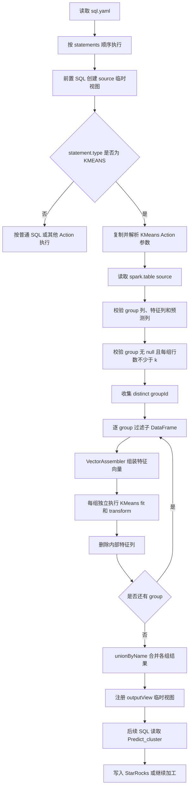
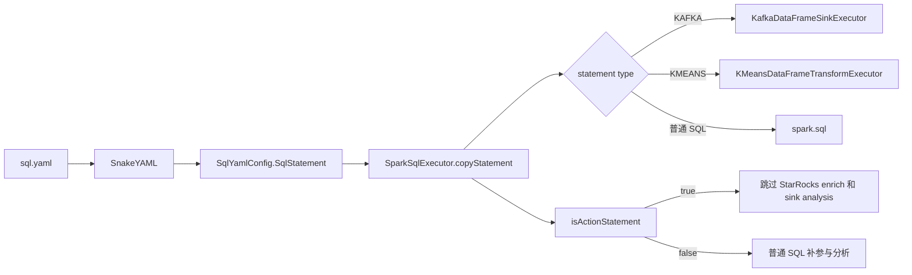
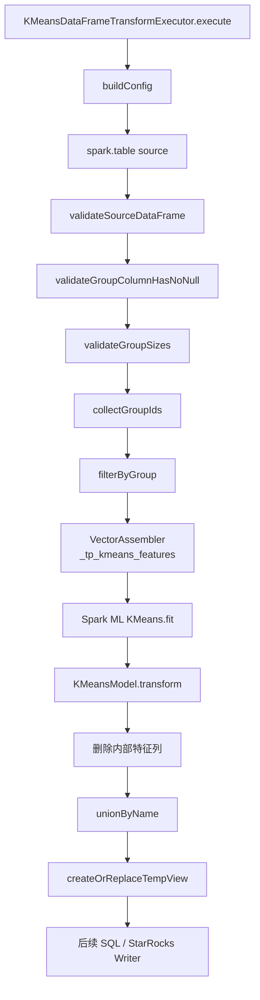

# TaskPlugin-Spark 分组 KMeans Action 开发模块设计文档

## 一、流程概述

### 1.1 业务背景

TaskPlugin-Spark 以 `sql.yaml` 中的 `statements` 顺序驱动 Spark SQL 执行。普通 DDL/DML 可以完成 Iceberg 数据读取、视图加工和 StarRocks 写入，但 KMeans 属于 Spark ML DataFrame API 能力，无法直接通过普通 Spark SQL 完整表达。

为在现有任务模型中接入机器学习计算，框架新增 `type: "KMEANS"` Action。该 Action 读取前置 SQL 创建的临时视图，通过 Spark ML 对数据执行聚类，并把结果注册为新的临时视图，供后续普通 SQL 写入 StarRocks 或进行其他加工。

当前代码已经在基础 KMeans Action 上扩展为分组聚类：业务通过 `groupIdColumnName` 指定分组列，框架对每个 group 分别训练 KMeans 模型，再合并各组结果。当前实现采用 `VectorAssembler -> KMeans fit -> transform`，不执行 StandardScaler，不保存模型，也不保证不同 group 或不同运行批次之间的聚类编号可比。

示例配置如下：

```yaml
statements:
  - type: "KMEANS"
    source: "kmeans_source"
    outputView: "kmeans_result"
    featuresCol: "periodAvgRtt,periodDropRate,avgDownloadSpeed"
    groupIdColumnName: "region_id"
    k: 5
    maxIter: 300
    seed: 42
```

### 1.2 核心业务流程



核心处理规则：

1. `KMEANS` 必须在“空 SQL 跳过”判断之前完成 Action 分流，因为该 Action 不配置 `sql` 字段。
2. `featuresCol` 是英文逗号分隔的列名字符串，执行器拆分、去除空格后交给 `VectorAssembler`。
3. `groupIdColumnName` 为必填列名，每个 group 使用相同的 `featuresCol`、`k`、`maxIter` 和 `seed`。
4. 每个 group 独立训练模型，`Predict_cluster` 仅表示组内聚类编号。
5. 输出视图保留源数据全部业务列，新增固定列 `Predict_cluster`，不保留框架内部向量列。
6. KMeans Action 只负责生成临时视图，不直接操作 StarRocks 或 Kafka。

### 1.3 功能模块划分

| 模块 | 模块职责 | 主要组件 |
|---|---|---|
| KMeans Action 配置与路由模块 | 扩展 YAML 模型、复制 Action 参数、识别 KMEANS 类型、控制执行顺序，并隔离普通 SQL、Kafka 和 StarRocks 分析链路 | `SqlYamlConfig`、`SparkSqlExecutor` |
| 分组聚类计算与结果输出模块 | 完成参数和 DataFrame 校验、分组、特征组装、模型训练、结果合并及输出视图注册 | `KMeansDataFrameTransformExecutor`、Spark MLlib、示例任务 |

两个模块以 `SqlYamlConfig.SqlStatement` 为输入契约。路由模块不承载算法细节；聚类模块不读取 YAML 文件，也不负责下游数据写入。

## 二、KMeans Action 配置与路由模块

### 2.1 概述

该模块负责让 `sql.yaml` 能表达 KMeans Action，并保证该 Action 正确进入 DataFrame 执行器。YAML 模型复用现有 `type` 和 `source` 字段，新增 KMeans 专属字段；`SparkSqlExecutor` 负责类型识别、Action 参数复制、日志输出和执行器委托。

KMeans Action 与普通 SQL 的主要差异如下：

| 对比项 | 普通 SQL | KMeans Action |
|---|---|---|
| 路由标记 | DDL/DML/SET 等 | `type: "KMEANS"` |
| `sql` 字段 | 必须提供可执行 SQL | 不使用，可为空 |
| 输入 | SQL 文本中引用表或视图 | `source` 指定 Spark 表或临时视图 |
| 输出 | SQL 执行结果或外部写入 | `outputView` 临时视图 |
| 执行组件 | `spark.sql(...)` | `KMeansDataFrameTransformExecutor` |
| StarRocks 分析 | 可进入 SQL enrich 和 sink 分析 | 必须跳过 |

### 2.2 变更文件

#### 生产代码

| 变更类型 | 文件 |
|---|---|
| 修改 | `task-plugin-spark/src/main/java/com/taskplugin/spark/sql/SqlYamlConfig.java` |
| 修改 | `task-plugin-spark/src/main/java/com/taskplugin/spark/sql/SparkSqlExecutor.java` |

#### 测试代码

| 变更类型 | 文件 |
|---|---|
| 修改 | `task-plugin-spark/src/test/java/com/taskplugin/spark/sql/SqlYamlConfigTest.java` |
| 新增/修改 | `task-plugin-spark/src/test/java/com/taskplugin/spark/sql/SparkSqlExecutorKMeansRoutingTest.java` |
| 修改 | `task-plugin-spark/src/test/java/com/taskplugin/spark/sql/SparkSqlExecutorKafkaRoutingTest.java` |
| 修改 | `task-plugin-spark/src/test/java/com/taskplugin/spark/sql/SparkSqlExecutorStarRocksTest.java` |

### 2.3 文件变更点概述

| 文件 | 主要变更点 |
|---|---|
| `SqlYamlConfig.java` | 在 `SqlStatement` 中新增 `outputView`、`featuresCol`、`groupIdColumnName`、`k`、`maxIter`、`seed` 及 getter/setter；继续复用已有 `type` 和 `source` |
| `SparkSqlExecutor.java` | 新增 `STATEMENT_TYPE_KMEANS`；新增 KMeans executor 成员和可注入测试构造器；在 Kafka Action 之后、空 SQL 跳过之前执行 KMeans 分流；增加 KMeans 开始/完成日志 |
| `SparkSqlExecutor.copyStatement` | 完整复制 KMeans 字段，防止执行前复制 statement 时丢失参数 |
| `SparkSqlExecutor.isKMeansStatement` | 对 `type` 做 trim 和忽略大小写匹配，识别 `KMEANS` Action |
| `SparkSqlExecutor.isActionStatement` | 将 Kafka 与 KMeans 统一归类为非 SQL Action，避免进入 StarRocks SQL enrich、sink 分析或普通 SQL 执行 |
| `SqlYamlConfigTest.java` | 验证 camelCase 字段和多列 `featuresCol` 能映射到 Java 模型 |
| `SparkSqlExecutorKMeansRoutingTest.java` | 验证无 `sql` 字段仍能执行、空 SQL 判断前完成路由、复制后参数完整、与 Kafka 混排互不影响 |
| `SparkSqlExecutorStarRocksTest.java` | 验证 KMeans Action 不进入 StarRocks SQL 补参和 sink 分析 |
| `SparkSqlExecutorKafkaRoutingTest.java` | 验证新增字段复制不影响 Kafka Action 的既有路由行为 |

KMeans Action 配置字段如下：

| 字段 | 类型 | 必填 | 说明 |
|---|---|---|---|
| `type` | String | 是 | 固定为 `KMEANS`，忽略大小写 |
| `source` | String | 是 | 前置 SQL 已注册的表或临时视图 |
| `outputView` | String | 是 | 聚类完成后注册的结果临时视图 |
| `featuresCol` | String | 是 | 1 至多个特征列，使用英文逗号分隔 |
| `groupIdColumnName` | String | 是 | 分组列名，不接受 SQL 表达式 |
| `k` | Integer | 是 | 每个 group 的聚类数量，必须大于 1 |
| `maxIter` | Integer | 是 | 最大迭代次数，必须大于 0 |
| `seed` | Long | 是 | 随机种子 |

### 2.4 关系图



### 2.5 影响分析

| 影响维度 | 影响说明 | 控制措施 |
|---|---|---|
| YAML 协议 | `SqlStatement` 新增多个可选字段 | 普通 SQL 和 Kafka Action 不设置这些字段时保持 null，不改变既有解析 |
| 执行顺序 | KMeans 没有 `sql` 字段，错误的判断顺序会导致 Action 被跳过 | KMeans 路由必须位于空 SQL 判断之前，并由路由测试锁定顺序 |
| Statement 复制 | 执行器会复制原始语句 | 新增字段必须同步复制，并增加回归断言 |
| StarRocks 链路 | 非 SQL Action 不应进入 SQL 改写或 sink 分析 | 统一通过 `isActionStatement` 排除 KAFKA/KMEANS |
| Kafka 链路 | 新增 KMeans 路由可能影响已有 Action 分支顺序 | 保持 Kafka 分支在前，并增加混排测试 |
| 日志 | 分组聚类需要定位任务和分组列 | 日志包含 taskId、runId、source、outputView、featuresCol 和 groupIdColumnName |
| 接口扩展 | 后续新增更多 ML Action 时可能继续增加 if 分支 | 可后续演进为 Action Executor 注册表，本期不扩大改造范围 |

## 三、分组聚类计算与结果输出模块

### 3.1 概述

该模块由 `KMeansDataFrameTransformExecutor` 实现，负责从 SparkSession 读取输入 DataFrame，对数据进行前置校验，按 group 拆分后逐组训练 KMeans 模型，并将各组结果合并为一个输出视图。

当前实现的算法链路为：

```text
source DataFrame
  -> Schema、null、group size 校验
  -> distinct groupId 收集
  -> 逐 group filter
  -> VectorAssembler
  -> KMeans fit
  -> KMeansModel transform
  -> 删除 _tp_kmeans_features
  -> unionByName
  -> createOrReplaceTempView(outputView)
```

当前代码不执行 StandardScaler。业务方应确保不同特征的量纲适合直接参与欧氏距离计算，必要时在前置 SQL 中完成标准化或归一化。

### 3.2 变更文件

#### 构建与生产代码

| 变更类型 | 文件 |
|---|---|
| 修改 | `pom.xml`，在依赖管理中增加 `spark-mllib_2.12` |
| 修改 | `task-plugin-spark/pom.xml`，引入 Spark MLlib 依赖 |
| 新增/修改 | `task-plugin-spark/src/main/java/com/taskplugin/spark/sql/KMeansDataFrameTransformExecutor.java` |

#### 测试代码

| 变更类型 | 文件 |
|---|---|
| 新增/修改 | `task-plugin-spark/src/test/java/com/taskplugin/spark/sql/KMeansDataFrameTransformExecutorTest.java` |

#### 示例任务

| 变更类型 | 文件 |
|---|---|
| 新增/修改 | `examples/spark/iceberg-kmeans-to-starrocks-task/app-config.yaml` |
| 新增/修改 | `examples/spark/iceberg-kmeans-to-starrocks-task/config.yaml` |
| 新增/修改 | `examples/spark/iceberg-kmeans-to-starrocks-task/sql/sql.yaml` |
| 新增 | `examples/spark/iceberg-kmeans-to-starrocks-task/starrocks_init.sql` |
| 新增/修改 | `examples/spark/iceberg-kmeans-to-starrocks-task/README.md` |

### 3.3 文件变更点概述

| 文件 | 主要变更点 |
|---|---|
| `pom.xml` | 统一管理 `spark-mllib_2.12` 版本，使 Spark SQL 与 Spark ML 版本保持一致 |
| `task-plugin-spark/pom.xml` | 将 MLlib API 加入 Spark 模块编译和运行 classpath |
| `KMeansDataFrameTransformExecutor.java` | 新增不可变 `KMeansActionConfig`；解析和校验参数；读取 `spark.table(source)`；检查 Schema、group null、每组行数和预测列冲突；逐组执行 `VectorAssembler + KMeans`；合并结果并注册输出视图 |
| `KMeansDataFrameTransformExecutorTest.java` | 覆盖参数 trim、单列/多列解析、固定列名、必填字段、数值边界和缺少 SparkSession 的执行保护 |
| 示例 `sql.yaml` | 依次创建 Iceberg 输入视图、执行分组 KMeans、声明 StarRocks sink 并写入 `Predict_cluster` |
| 示例 `config.yaml` | 配置 Iceberg catalog、SQL 文件和 Spark 运行参数 |
| `starrocks_init.sql` | 创建包含 `Predict_cluster` 的目标表结构，供 Beta 环境验证 |
| 示例 `README.md` | 说明前置数据、配置、运行步骤、结果查询和常见问题 |

执行器的主要校验如下：

| 校验项 | 规则 | 失败结果 |
|---|---|---|
| Action 对象 | statement 不能为 null | 抛出参数异常 |
| 字符串参数 | source、outputView、featuresCol、groupIdColumnName 去空格后不能为空 | 抛出包含字段名的参数异常 |
| 聚类参数 | `k > 1`、`maxIter > 0`、seed 非空 | 参数异常，不启动 Spark Job |
| 特征列表 | 按英文逗号拆分，每个列名去空格后非空 | 存在空列名时失败 |
| group 列 | 必须在 source 中精确存在 | 缺失时失败 |
| 特征列 | 每个特征列必须在 source 中精确存在 | 缺失时失败 |
| 预测列 | source 中不能已存在大小写任意形式的 `Predict_cluster` | 避免覆盖业务列，直接失败 |
| group null | 分组列不允许出现 null | 检测到任一 null 后失败 |
| group 行数 | 每个 group 行数必须大于等于 k | 错误包含 group 列、group 值、行数和 k |
| 空数据 | distinct group 结果为空 | 抛出 source 无数据异常 |

### 3.4 关系图



### 3.5 影响分析

| 影响维度 | 影响说明 | 控制措施 |
|---|---|---|
| 模型语义 | 每个 group 独立训练，簇编号只在组内有效 | 下游必须同时保留 groupId 与 `Predict_cluster`，不得跨组直接比较编号 |
| 批次稳定性 | 每次运行重新训练，即使 seed 相同也依赖输入数据和运行环境 | 不将编号作为长期稳定标签；如需稳定标签应建设模型持久化和中心对齐 |
| 特征量纲 | 当前不执行 StandardScaler | 前置 SQL 负责必要的归一化；Beta 测试检查特征量纲和聚类合理性 |
| group 数量 | distinct groupId 收集到 Driver，并逐组触发训练 | 限制单任务 group 数量；上线前做规模测试和 Driver 内存评估 |
| 计算开销 | 每个 group 单独 fit，group 数越多 Spark Job 和模型训练次数越多 | 控制并发和 group 规模；通过日志监控 groupCount 与执行时长 |
| 数据扫描 | group 校验、groupId 收集和逐组 filter 会触发多次计算 | 评估是否缓存 source；本期保持实现简单，后续再做性能优化 |
| 输入质量 | null、非数值特征、NaN/Infinity 会导致失败或无效结果 | 前置 SQL 做 CAST、过滤和质量校验；补充异常数据测试 |
| 输出 Schema | 输出增加固定列 `Predict_cluster` | 执行前拒绝源表同名列；下游表预先创建整数类型字段 |
| 临时视图 | `createOrReplaceTempView` 属于共享 SparkSession | 多任务使用唯一 outputView，避免相互覆盖 |
| 依赖 | 新增 Spark MLlib 依赖 | 与 Spark Core/SQL 使用相同版本，发布环境验证 classpath 无冲突 |
| 失败范围 | 任一 group 不满足条件会使整个 Action 失败 | 错误日志包含具体 group；本期不自动跳过坏组或降低 k |
| 结果合并 | 各组通过 `unionByName` 合并 | 保证所有组源 Schema 一致，并验证输出行数等于输入行数 |

## 四、测试建议

### 4.1 单元测试

| 测试对象 | 建议测试场景 | 核心断言 |
|---|---|---|
| `SqlYamlConfigTest` | 完整 KMEANS YAML | 所有 camelCase 字段、数值参数和多列 featuresCol 解析正确 |
| `SparkSqlExecutor` copy 测试 | 复制 KMeans statement | source、outputView、featuresCol、groupIdColumnName、k、maxIter、seed 均不丢失 |
| `SparkSqlExecutorKMeansRoutingTest` | KMEANS 无 sql 字段 | 在空 SQL 跳过判断前调用 KMeans executor |
| `SparkSqlExecutorKMeansRoutingTest` | KAFKA、KMEANS、普通 SQL 混排 | 按配置顺序分别进入对应执行器，互不串路由 |
| `SparkSqlExecutorStarRocksTest` | KMeans 与 StarRocks SQL 混排 | KMeans Action 不进入 SQL 补参和 sink 分析 |
| `KMeansDataFrameTransformExecutorTest` | 字符串参数含空格 | 配置值 trim 后正确保存 |
| `KMeansDataFrameTransformExecutorTest` | 单列和逗号分隔多列 | featureColumns 顺序和列名正确 |
| 参数校验 | 缺少任一必填项、`k <= 1`、`maxIter <= 0` | 抛出准确、可定位的错误信息 |
| Schema 校验 | group/特征列不存在、预测列已存在 | Action 在训练前失败 |
| 数据校验 | group 有 null、某组行数小于 k、source 为空 | 分别返回对应异常，错误包含 group 上下文 |
| 分组聚类 | 多个非连续 groupId | 各组独立产生聚类结果并成功合并 |
| 输出结果 | 正常数据集 | 行数与输入一致；保留原始列；包含 `Predict_cluster`；不包含内部向量列 |
| 可复现性 | 相同输入、相同 seed 重复执行 | 在相同 Spark 版本和参数下结果一致 |

### 4.2 Beta 测试

| 场景 | 测试内容 | 验证重点 |
|---|---|---|
| Iceberg 输入 | 从目标 Iceberg 表创建 KMeans source 视图 | 字段类型、数据量和 group 分布满足聚类要求 |
| KMeans 执行 | 使用生产相近的 group 数、k 和特征维度运行 | Driver 内存、Job 数量、总耗时和失败日志 |
| StarRocks 输出 | 将 outputView 写入目标表 | 行数一致、业务字段完整、`Predict_cluster` 为整数 |
| 多 group 结果 | 查询各 group 的簇分布 | 每个 group 均产生不超过 k 个簇，编号只在组内解释 |
| 异常数据 | 注入 null group、缺失列、小样本组和同名预测列 | Action 明确失败且不产生不完整下游数据 |
| 多任务并发 | 多个 KMeans 任务共享 SparkSession | outputView 不冲突，各任务日志可按 taskId/runId 区分 |
| 重复运行 | 使用相同 seed 和输入重复执行 | 结果可复现，临时视图可正常覆盖 |
| 性能边界 | 逐步增加 group 数量、单组行数和特征列数量 | 得到可接受规模阈值及资源配置建议 |
| 回归测试 | 同一任务中混合普通 SQL、Kafka 和 StarRocks Action | 原有路由、SQL 补参和写入能力不受影响 |

## 五、总结

分组 KMeans 能力通过 `SqlYamlConfig` 和 `SparkSqlExecutor` 扩展既有 Action 机制，再由 `KMeansDataFrameTransformExecutor` 完成参数校验、分组、特征组装、逐组训练和结果合并。该设计保持 SQL 执行框架不变，KMeans 只生成临时视图，下游仍使用原有 SQL、StarRocks 或 Kafka 能力。

当前实现适合 group 数量可控的批处理场景。应用时应重点关注特征量纲、组内样本数、簇编号的局部语义、共享临时视图命名和逐组训练的性能开销。若未来需要大量 group、高频训练或稳定模型标签，应将模型持久化、批量训练优化和聚类中心管理作为独立模块演进。
