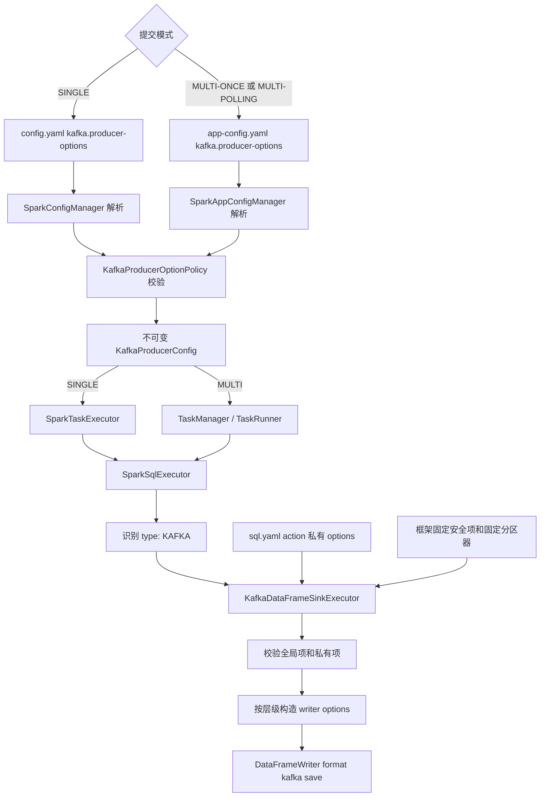
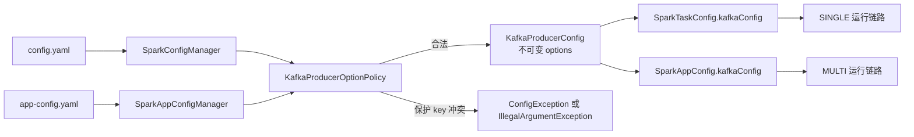
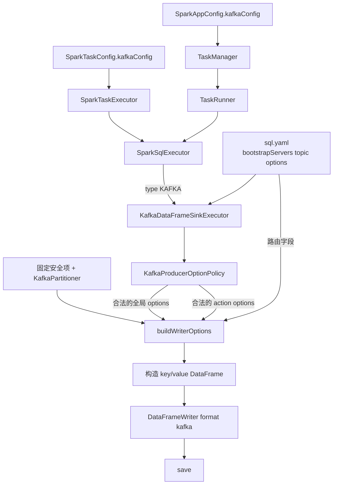

# TaskPlugin-Spark Kafka Producer Options 分层配置开发模块设计文档

## 一、流程概述

### 1.1 业务背景

TaskPlugin-Spark 已通过 `type: "KAFKA"` 的 SQL YAML action 使用 Spark DataFrame Writer 写入 Kafka。每个 action 原本可以在 `options` 中声明 Producer 参数，但公共参数需要在不同任务中重复配置，安全协议、分区器等平台约束也缺少统一的配置层级和冲突治理。

本次开发在不改变 Kafka action 总体执行模型的前提下，引入三类 Producer Options：

| 配置层 | 配置来源 | 作用范围 | 覆盖规则 |
|---|---|---|---|
| 框架固定项 | `KafkaDataFrameSinkExecutor` 代码常量 | 每一次 Kafka DataFrame write | 始终生效，用户配置中出现同名 key 直接报错 |
| 全局默认项 | SINGLE 的 `config.yaml` 或 MULTI 的 `app-config.yaml` | 当前任务或当前 Spark Application 下的 Kafka action | 普通参数可被 action 私有值覆盖 |
| Action 私有项 | `sql.yaml` 中 KAFKA action 的 `options` | 当前 action | 普通参数优先级最高，但不得声明保护 key |

该需求开发边界中，`bootstrapServers` 和 `topic` 仍属于 action 顶层路由字段，不参与 `producer-options` 合并；Kafka source、streaming sink、动态 topic 和固定安全参数外置均不属于本模块。

### 1.2 核心业务流程



运行时处理顺序为：

1. 对应提交模式的配置管理器解析 `kafka.producer-options`。
2. `KafkaProducerOptionPolicy` 在任务启动或 Action 执行前拒绝固定项、框架保留项和路由项。
3. 合法配置复制到不可变 `KafkaProducerConfig`，沿既有对象关系显式传递。
4. `SparkSqlExecutor` 识别 Kafka Action，并委托 `KafkaDataFrameSinkExecutor`。
5. Writer 组合路由字段、固定安全项、固定分区器、全局普通项和 Action 私有普通项。
6. 完成 key/value DataFrame 构造后，通过 Spark Kafka Connector 批量写入。

### 1.3 功能模块划分

| 模块 | 模块职责 | 主要组件 |
|---|---|---|
| Producer Options 配置与治理模块 | 定义共享配置对象、保护 key 策略，解析 SINGLE/MULTI 配置并在调度前校验 | `KafkaProducerConfig`、`KafkaProducerOptionPolicy`、`SparkTaskConfig`、`SparkConfigManager`、`SparkAppConfig`、`SparkAppConfigManager` |
| 配置传递与 Kafka Writer 执行模块 | 将全局配置沿 SINGLE/MULTI 链路传至 SQL 执行器，完成固定项注入、分层合并和 DataFrame 写入 | `SparkTaskExecutor`、`TaskRunner`、`SparkSqlExecutor`、`KafkaDataFrameSinkExecutor` |

模块之间只通过不可变 `KafkaProducerConfig` 传递数据，不增加静态全局 Holder。这样可以沿用任务配置对象的生命周期，并便于针对不同提交模式构造独立测试。

## 二、Producer Options 配置与治理模块

### 2.1 概述

该模块负责将 `kafka.producer-options` 统一映射为共享配置模型，并集中维护用户可配置边界。SINGLE 模式从任务目录下的 `config.yaml` 读取全局默认项；`MULTI-ONCE` 和 `MULTI-POLLING` 从宿主 `app-config.yaml` 读取，并由同一 Spark Application 中的全部 Kafka 子任务共享。

配置模型采用不可变 Map，避免解析完成后被执行线程修改。保护策略按 key 类型分为三组：

| 保护类型 | 示例 | 原因 |
|---|---|---|
| 框架固定安全项 | `kafka.security.protocol`、`kafka.sasl.mechanism`、`kafka.ssl.truststore.location` | 由平台安全规范固定，不允许业务覆盖 |
| 框架保留项 | `kafka.partitioner.class`、`partitioner.class`、xxhash seed | 保护自定义分区器与一致性逻辑 |
| Action 路由项 | `topic`、`kafka.bootstrap.servers` | 必须由 action 顶层字段表达，不属于可合并 Producer Options |

所有 key 校验忽略大小写并去除首尾空格；空 key 和 null value 明确拒绝，空字符串 value 可以保留，用于 `kafka.ssl.endpoint.identification.algorithm` 等合法场景。

### 2.2 变更文件

#### 生产代码

| 变更类型 | 文件 |
|---|---|
| 新增 | `task-plugin-spark/src/main/java/com/taskplugin/spark/kafka/KafkaProducerConfig.java` |
| 新增 | `task-plugin-spark/src/main/java/com/taskplugin/spark/kafka/KafkaProducerOptionPolicy.java` |
| 修改 | `task-plugin-spark/src/main/java/com/taskplugin/spark/config/SparkTaskConfig.java` |
| 修改 | `task-plugin-spark/src/main/java/com/taskplugin/spark/config/SparkConfigManager.java` |
| 修改 | `task-plugin-spark/src/main/java/com/taskplugin/spark/app/SparkAppConfig.java` |
| 修改 | `task-plugin-spark/src/main/java/com/taskplugin/spark/app/SparkAppConfigManager.java` |

#### 测试代码与测试配置

| 变更类型 | 文件或目录 |
|---|---|
| 新增 | `task-plugin-spark/src/test/java/com/taskplugin/spark/kafka/KafkaProducerConfigTest.java` |
| 新增 | `task-plugin-spark/src/test/java/com/taskplugin/spark/config/SparkConfigManagerTest.java` |
| 修改 | `task-plugin-spark/src/test/java/com/taskplugin/spark/app/SparkAppConfigManagerTest.java` |
| 新增 | `task-plugin-spark/src/test/resources/config/single-with-kafka-producer-options.yaml` |
| 新增 | `task-plugin-spark/src/test/resources/config/single-with-fixed-kafka-option.yaml` |
| 新增 | `task-plugin-spark/src/test/resources/config/single-with-reserved-kafka-option.yaml` |
| 新增 | `task-plugin-spark/src/test/resources/app-config/multi-once-with-kafka-producer-options.yaml` |
| 新增 | `task-plugin-spark/src/test/resources/app-config/multi-polling-with-kafka-producer-options.yaml` |
| 新增 | `task-plugin-spark/src/test/resources/app-config/single-with-kafka-producer-options.yaml` |

### 2.3 文件变更点概述

| 文件 | 主要变更点 |
|---|---|
| `KafkaProducerConfig.java` | 封装 Producer Options；构造时复制 Map；对外返回不可变视图；提供 `empty()` 供未配置场景复用，避免下游判空 |
| `KafkaProducerOptionPolicy.java` | 集中定义九项固定安全 key、框架保留 key 和 Action 路由 key；提供统一 `validateUserOptions`；校验大小写、空白 key 和 null value |
| `SparkTaskConfig.java` | 新增默认非空的 `KafkaProducerConfig` 字段，承载 SINGLE 任务的全局默认项 |
| `SparkConfigManager.java` | 将 `kafka` 纳入顶层白名单；解析 `producer-options` 并将 YAML 值转换为字符串；在 SINGLE 任务启动前调用保护策略校验 |
| `SparkAppConfig.java` | 新增默认非空的 `KafkaProducerConfig` 字段，承载 MULTI 宿主应用的共享默认项 |
| `SparkAppConfigManager.java` | 解析 app-config 的 `kafka.producer-options`；在 `MULTI-ONCE`、`MULTI-POLLING` 启动调度前校验；拒绝 `SINGLE` 在 app-config 错误声明该配置，因为 SINGLE 应从任务 `config.yaml` 读取 |
| `KafkaProducerConfigTest.java` | 覆盖不可变性、空配置、三类保护 key、大小写、空 key、null value 和空字符串值 |
| 配置管理器测试 | 覆盖两种配置来源、普通值字符串化、保护 key 拒绝及未配置 Kafka 区域的兼容行为 |

`kafka.producer-options` 的配置归属如下：

```yaml
# SINGLE：任务 config.yaml
kafka:
  producer-options:
    kafka.acks: "all"
    kafka.compression.type: "lz4"

# MULTI：宿主 app-config.yaml
kafka:
  producer-options:
    kafka.acks: "all"
    kafka.linger.ms: "20"
```

### 2.4 关系图



### 2.5 影响分析

| 影响维度 | 影响说明 | 控制措施 |
|---|---|---|
| 配置结构 | SINGLE 和 MULTI 使用相同 `kafka.producer-options` schema，但位于不同配置文件 | 配置管理器按 submit-mode 明确归属，SINGLE 错配到 app-config 时直接拒绝 |
| 启动时机 | 全局配置错误由配置阶段提前暴露 | 配置管理器调用统一 Policy，错误信息包含配置来源和冲突 key |
| 线程安全 | MULTI 子任务共享同一配置对象 | Map 构造时复制并以不可变视图暴露，不允许运行期修改 |
| 兼容性 | 未配置 Kafka 区域的任务仍需正常解析 | 配置字段默认使用 `KafkaProducerConfig.empty()` |
| Key 大小写 | Kafka option key 可能以不同大小写绕过保护 | Policy 统一 trim 并转小写比较 |
| 配置值类型 | YAML 数字和布尔值可能不是字符串 | 解析时统一转为字符串后交给 Spark Writer |
| 敏感参数 | Producer Options 未来可能包含敏感值 | 日志仅记录 key 或配置来源，不输出完整 value |
| 维护成本 | 固定项若分散在解析器和 Writer 中易出现不一致 | Policy 维护禁止集合，Writer 维护最终固定值，测试校验二者对应 |

## 三、配置传递与 Kafka Writer 执行模块

### 3.1 概述

该模块将已校验的 `KafkaProducerConfig` 沿两条运行路径显式传入 Kafka Writer：

```text
SINGLE:
config.yaml -> SparkTaskConfig -> SparkTaskExecutor
            -> SparkSqlExecutor -> KafkaDataFrameSinkExecutor

MULTI-ONCE / MULTI-POLLING:
app-config.yaml -> SparkAppConfig -> TaskManager -> TaskRunner
                -> SparkSqlExecutor -> KafkaDataFrameSinkExecutor
```

两条路径最终在 `SparkSqlExecutor` 汇合。SQL 执行器仅负责识别 `type: "KAFKA"` 并转交 action；真正的字段校验、DataFrame 构造、Options 合并和 `writer.save()` 由 `KafkaDataFrameSinkExecutor` 完成。

Writer 的逻辑合并顺序为：

```text
Action 路由字段
  -> 框架固定安全项
  -> 框架固定 KafkaPartitioner
  -> 全局普通 Producer Options
  -> Action 私有普通 Options
```

由于全局项和私有项在合并前均经过保护策略校验，后写入的用户配置不可能覆盖固定安全项、固定分区器或路由字段。普通参数同名时，Action 私有值覆盖全局默认值。

### 3.2 变更文件

#### 生产代码

| 变更类型 | 文件 |
|---|---|
| 修改 | `task-plugin-spark/src/main/java/com/taskplugin/spark/executor/SparkTaskExecutor.java` |
| 修改 | `task-plugin-spark/src/main/java/com/taskplugin/spark/app/TaskRunner.java` |
| 修改 | `task-plugin-spark/src/main/java/com/taskplugin/spark/sql/SparkSqlExecutor.java` |
| 修改 | `task-plugin-spark/src/main/java/com/taskplugin/spark/sql/KafkaDataFrameSinkExecutor.java` |

#### 测试代码

| 变更类型 | 文件 |
|---|---|
| 修改 | `task-plugin-spark/src/test/java/com/taskplugin/spark/sql/KafkaDataFrameSinkExecutorTest.java` |
| 修改 | `task-plugin-spark/src/test/java/com/taskplugin/spark/sql/SparkSqlExecutorKafkaRoutingTest.java` |
| 修改 | `task-plugin-spark/src/test/java/com/taskplugin/spark/app/TaskRunnerTest.java` |

#### SINGLE 业务示例

| 变更类型 | 文件或目录 |
|---|---|
| 新增 | `examples/spark/iceberg-to-kafka-producer-options-single-task/app-config.yaml` |
| 新增 | `examples/spark/iceberg-to-kafka-producer-options-single-task/config.yaml` |
| 新增 | `examples/spark/iceberg-to-kafka-producer-options-single-task/sql/sql.yaml` |
| 新增 | `examples/spark/iceberg-to-kafka-producer-options-single-task/deploy.sh` |
| 新增 | `examples/spark/iceberg-to-kafka-producer-options-single-task/run.sh` |
| 新增 | `examples/spark/iceberg-to-kafka-producer-options-single-task/verify.sh` |
| 新增 | `examples/spark/iceberg-to-kafka-producer-options-single-task/README.md` |

### 3.3 文件变更点概述

| 文件 | 主要变更点 |
|---|---|
| `SparkTaskExecutor.java` | SINGLE 初始化 SQL 执行器时传入 `SparkTaskConfig.getKafkaConfig()`，完成任务级配置接线 |
| `TaskRunner.java` | MULTI 子任务创建 SQL 执行器时传入 `appConfig.getKafkaConfig()`；无 appConfig 时使用空配置行为；不新增静态共享状态 |
| `SparkSqlExecutor.java` | 新增接收 `KafkaProducerConfig` 的构造路径；默认构造器使用空配置；保留可注入 Kafka executor 的测试构造器；Kafka action 路由逻辑不变 |
| `KafkaDataFrameSinkExecutor.java` | 新增 `globalProducerOptions`；内置九项固定安全参数；复用统一 Policy 校验全局与私有 options；按分层顺序构造不可变 writer options；保留固定 `KafkaPartitioner` |
| `KafkaDataFrameSinkExecutorTest.java` | 覆盖固定项注入、无全局配置、普通参数继承和覆盖、三类保护 key 在全局/私有层的拒绝行为 |
| `SparkSqlExecutorKafkaRoutingTest.java` | 验证配置感知构造路径能把 Kafka 配置传入 sink，并在构造阶段执行保护校验 |
| `TaskRunnerTest.java` | 验证 MULTI 共用路径在读取并执行子任务前传递应用级 Kafka 配置 |
| SINGLE 示例 | 展示 config.yaml 全局配置、sql.yaml 私有覆盖、部署、提交和消费验证的完整闭环 |

固定安全参数包括：

| Key | 固定值 |
|---|---|
| `kafka.security.protocol` | `SASL_SSL` |
| `kafka.sasl.mechanism` | `GSSAPI` |
| `kafka.sasl.kerberos.service.name` | `kafka` |
| `kafka.ssl.engine.factory.class` | `org.apache.kafka.common.security.ssl.CertEnhancedSslEngineFactory` |
| `kafka.ssl.endpoint.identification.algorithm` | 空字符串 |
| `kafka.ssl.truststore.location` | `/opt/ndp/conf/test/DAYUClient/Client/Kafka/config/ssl/trust.cer` |
| `kafka.ssl.truststore.type` | `PEM` |
| `kafka.kerberos.domain.name` | `hadoop.hadoop.com` |
| `kafka.security.protocol.ssl` | `SSL` |

### 3.4 关系图



### 3.5 影响分析

| 影响维度 | 影响说明 | 控制措施 |
|---|---|---|
| Writer 行为 | 每次写入自动携带九项安全参数和固定分区器 | 固定值集中为不可变常量，并由单元测试逐项断言 |
| 普通参数覆盖 | Action 私有普通项可以覆盖同名全局项 | 使用 LinkedHashMap 按层级 putAll，测试覆盖继承与覆盖 |
| 保护参数 | 过去在私有 options 中声明固定安全项的任务将失败 | 上线前扫描现有 SQL，删除重复固定项并给出迁移说明 |
| SINGLE 链路 | 配置从任务 config.yaml 传至 Writer | 仅修改构造参数，不改变任务执行、SQL 路由和 DataFrame 写入步骤 |
| MULTI 链路 | 同一 appConfig 的全局项供全部子任务共享 | 使用不可变配置对象；各 Action 的私有 Map 仅在当前执行中合并 |
| 非 Kafka SQL | SQL 执行器新增构造参数，但普通 SQL 不消费 Kafka 配置 | 默认空配置和兼容构造器保证其他路由不受影响 |
| 配置生命周期 | 未使用静态 Holder | 配置随 `SparkTaskConfig`/`SparkAppConfig` 生命周期传递，测试可独立构造 |
| 安全环境 | truststore 路径为发布时固定值 | Beta 环境核对路径和文件权限；不同环境需在构建发布前调整常量 |
| Kafka 路由 | 本需求中 broker 与 topic 继续由 Action 顶层提供 | Policy 禁止在全局/私有 Options 中重复声明，避免路由来源不清 |
| 后续演进 | Kafka Writer 后续可能切换序列化方式或 broker 配置来源 | 将 Options 合并保持为独立方法，后续 Writer 改造仍复用 Policy 和配置传递链路 |

## 四、测试建议

### 4.1 单元测试

| 测试类 | 建议覆盖场景 | 核心断言 |
|---|---|---|
| `KafkaProducerConfigTest` | null、空 Map、普通 Map、外部 Map 后续修改 | 空对象可复用；内部值不可被外部修改；返回 Map 不可写 |
| `KafkaProducerConfigTest` | 固定、保留和路由 key 的大小写及空格变体 | 保护分类忽略大小写和首尾空格 |
| `KafkaProducerConfigTest` | 空 key、null value、空字符串 value | 前两者失败；空字符串按合法配置保留 |
| `SparkConfigManagerTest` | SINGLE 正常解析普通 Producer Options | YAML 数字、布尔和字符串均转换为字符串并进入 `SparkTaskConfig` |
| `SparkConfigManagerTest` | SINGLE 配置包含保护 key | 在启动单任务前失败，错误包含来源和 key |
| `SparkAppConfigManagerTest` | MULTI-ONCE、MULTI-POLLING 正常解析 | 两种模式均获得同一 schema 的 `KafkaProducerConfig` |
| `SparkAppConfigManagerTest` | SINGLE 在 app-config 声明 Kafka 全局项 | 明确拒绝并提示应配置在任务 `config.yaml` |
| `KafkaDataFrameSinkExecutorTest` | 无全局配置 | 最终 options 仍包含路由字段、九项固定安全参数和分区器 |
| `KafkaDataFrameSinkExecutorTest` | 全局普通项 + 私有普通项 | 私有同名值覆盖全局值，未覆盖项继续继承 |
| `KafkaDataFrameSinkExecutorTest` | 全局或私有包含任一保护 key | 在调用 writer 前失败，不产生外部写入 |
| `SparkSqlExecutorKafkaRoutingTest` | 配置感知构造路径 | Kafka 配置进入 sink；普通 SQL 路由不受影响 |
| `TaskRunnerTest` | MULTI 配置传递 | 每个 TaskRunner 均使用 appConfig 中的全局配置，不共享可变 Map |
| 回归测试 | 未配置 Kafka 区域的既有任务 | 配置解析、普通 SQL、StarRocks 和 polling input 行为不变 |

建议将 `buildWriterOptions` 保持为包内可测试方法，直接对最终 Map 做断言，避免单元测试真正连接 Kafka。Writer `.save()` 的网络和认证行为放到 Beta 环境验证。

### 4.2 Beta 测试

项目使用公司定制 Kafka/Spark 依赖，原实施环境因依赖仓库不可用未完成正式 Maven 编译和测试执行。Beta 前应先在能够解析下列依赖及其传递依赖的构建环境重新执行完整测试：

```text
org.apache.kafka:kafka-clients:3.9.1-h3.gdd.naie.r6127
org.apache.spark:spark-token-provider-kafka-0-10_2.12:3.5.6-h3.gdd.naie.r6154
org.apache.spark:spark-sql-kafka-0-10_2.12:3.5.6-h3.gdd.naie.r6154
```

| 编号 | 场景 | 操作要点 | 通过标准 |
|---|---|---|---|
| B-01 | SINGLE 全局配置 | 运行新增 Producer Options SINGLE 示例 | 消息写入成功，未配置在 Action 的普通项继承全局值 |
| B-02 | SINGLE 私有覆盖 | 全局和 Action 同时设置不同 `kafka.linger.ms` | 最终使用 Action 私有值，其他全局值仍生效 |
| B-03 | MULTI-ONCE 共享 | 两个 Kafka 子任务共享 app-config，各自配置不同私有项 | 两个任务均获得全局项，私有覆盖互不影响 |
| B-04 | MULTI-POLLING 稳定性 | 同一任务连续运行多个轮次 | 每轮使用启动时加载的同一全局配置，无配置漂移 |
| B-05 | 固定项保护 | 在全局配置中加入 `kafka.security.protocol=PLAINTEXT` | 应用在任务执行前失败，错误指出固定 key |
| B-06 | 私有项保护 | 在 Action options 中加入 truststore 或 partitioner key | Action 在写入前失败，Kafka 无新增消息 |
| B-07 | 安全认证 | 使用 Kerberos、SSL 和固定 truststore 连接 Beta Kafka | 认证成功，Driver/Executor 无证书和 GSSAPI 错误 |
| B-08 | 数据正确性 | 消费目标 topic 并核对 key/value 和消息数量 | Key/value 与源 DataFrame 一致，无异常丢失或重复 |
| B-09 | 并发压力 | 按生产预估并发运行多个 Kafka Action | Producer 无明显超时，Spark Executor 和 Kafka Broker 指标处于阈值内 |
| B-10 | 失败重试 | 模拟 broker 不可用、topic 不存在或权限不足 | 任务失败信息可定位；恢复环境后重跑成功；无静默吞错 |
| B-11 | 非 Kafka 回归 | 同一版本运行普通 SQL、StarRocks 和 Iceberg polling 任务 | 非 Kafka 路由不读取或应用 Kafka Options |
| B-12 | 日志安全 | 检查 Driver 和 Executor 日志 | 不输出完整敏感 option value，能看到配置来源和冲突 key |

Beta 测试退出条件：所有 Producer Options 相关单元测试在正式依赖环境通过；SINGLE 和至少一种 MULTI 模式完成真实 Kafka 写入；固定项保护、私有覆盖、认证和非 Kafka 回归均符合预期；目标 topic 的数据量和字段内容通过核对。

## 五、总结

本次开发以 `KafkaProducerConfig` 和 `KafkaProducerOptionPolicy` 建立统一的配置与治理边界，再通过 `SparkTaskExecutor`、`TaskRunner` 和 `SparkSqlExecutor` 将配置显式传递到 `KafkaDataFrameSinkExecutor`。Writer 在一次写入中完成固定安全项、固定分区器、全局普通项和 Action 私有项的分层组合。

设计结果避免了公共参数在各 `sql.yaml` 中重复声明，也避免业务配置绕过平台安全和分区规则。SINGLE 与 MULTI 使用相同 schema 和治理策略，但保持各自正确的配置归属；非 Kafka SQL 通过空配置和兼容构造器保持原行为。后续 Kafka 序列化方式或 broker 来源发生变化时，可继续复用本次建立的 Options Policy、不可变配置模型和分层合并机制。
