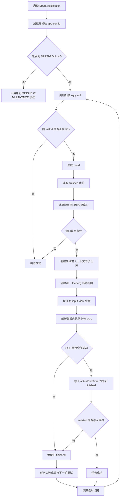
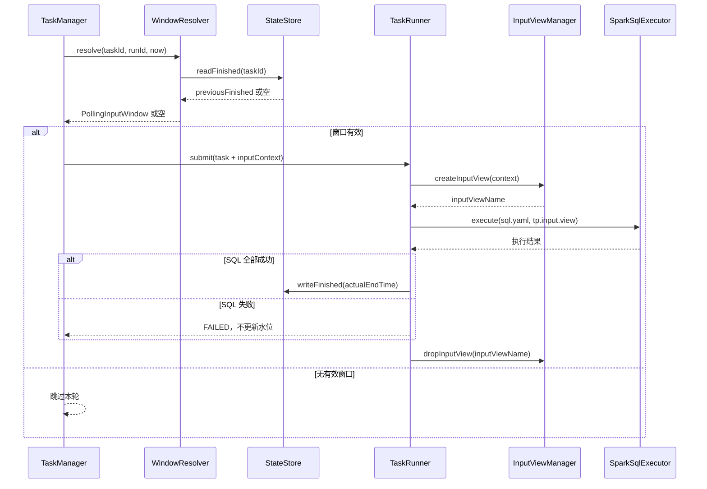

# TaskPlugin-Spark MULTI-POLLING Iceberg 连续窗口输入需求分析说明书

## 1. 项目背景

TaskPlugin-Spark 已支持以 `MULTI-POLLING` 模式将一个 Spark Application 常驻于 YARN，并按照配置周期扫描任务目录中的 `sql.yaml`，再以子任务方式重复执行。该模式解决了“应用常驻、任务自动发现和周期调度”的问题，但尚未解决“每轮应读取哪一段新增数据”的问题。

在既有模式下，如果业务 SQL 固定引用同一张 Iceberg 表或固定输入路径，每轮轮询都会重复读取历史数据，容易产生以下问题：

- 同一批数据被重复计算和重复写入；
- 任务失败或应用重启后，无法确认应从哪个时间点继续处理；
- 业务 SQL 需要自行维护时间条件，多个任务之间实现方式不一致；
- 常驻应用缺少可持久化的处理水位，无法形成连续、可追踪的数据处理链路；
- 轮询间隔、数据到达延迟和时间粒度之间缺少统一约束，可能形成数据空洞或交叉窗口。

因此，需要在现有 `MULTI-POLLING` 调度能力之上增加 Iceberg 连续时间窗口输入能力：框架在每次子任务启动前计算本轮输入窗口，结合上次成功处理水位确定实际读取范围，创建唯一临时视图，并将该视图注入业务 SQL。业务 SQL 只表达计算逻辑，不再感知时间窗口、状态文件和 Iceberg 过滤条件。

## 2. 需求目标

本项目目标如下：

1. 为 `MULTI-POLLING` 模式提供基于 Iceberg 表的连续时间窗口读取能力。
2. 由框架统一计算输入窗口，确保正常运行时相邻窗口首尾相接、无交集、无缺口。
3. 使用持久化 finished 水位记录每个任务上次成功处理到的时间右边界。
4. 任务失败、执行阻塞或应用重启后，能够从原 finished 水位继续追赶未处理数据。
5. 由框架创建当前运行实例专属的 Iceberg 临时视图，并通过 `${tp.input.view}` 注入业务 SQL。
6. 业务 SQL 无需感知 Iceberg 表名、时间条件、窗口边界和临时视图命名规则。
7. 保持 `SINGLE`、`MULTI-ONCE` 既有执行行为不变。
8. 对配置错误、暂不支持的输入类型和无有效窗口等场景提供明确、可预测的处理结果。
9. 为运行日志、问题追踪和后续扩展提供完整的窗口、runId、视图名及水位信息。

## 3. 项目已有能力

需求提出前，TaskPlugin-Spark 已具备以下基础能力：

| 已有能力 | 能力说明 | 与本需求的关系 |
|---|---|---|
| 统一应用配置 | 可通过 `app-config.yaml` 描述应用、Spark、调度和任务发现参数 | 可在现有配置模型中增加 `polling-input` 配置块 |
| 常驻轮询模式 | `MULTI-POLLING` 可按 `discovery.polling-interval` 周期扫描任务 | 为连续窗口任务提供周期触发入口 |
| 任务自动发现 | `TaskDiscoveryService` 可按根目录和匹配规则发现 `sql.yaml` | 每个被发现的 `sql.yaml` 可映射为独立水位任务 |
| 并发任务管理 | `TaskManager` 支持线程池、队列和同 `taskId` 运行去重 | 可避免同一任务的相邻窗口并发执行 |
| 运行实例标识 | 每次任务执行可生成独立 `runId` | 可关联窗口、日志和 finished marker 更新记录 |
| SQL YAML 执行 | `SparkSqlExecutor` 可读取并顺序执行 `sql.yaml` 中的 SQL | 可在 YAML 解析前增加变量替换，在执行前创建输入视图 |
| 共享 SparkSession | 多个子任务可共享同一个 SparkSession | 需要通过唯一视图名和执行后清理避免并发冲突 |
| HDFS 访问 | 已具备 HDFS 文件读取和任务目录扫描能力 | 可扩展为 finished marker 的读写存储能力 |

现有能力与本需求之间仍存在以下缺口：

| 能力缺口 | 直接影响 |
|---|---|
| 无统一输入窗口计算 | 每轮任务无法确定应读取的数据时间范围 |
| 无成功水位持久化 | 失败、阻塞或重启后无法连续恢复 |
| 无框架输入视图 | 业务 SQL 必须重复编写 Iceberg 表和时间过滤条件 |
| 无框架变量注入 | 业务 SQL 与每次运行动态生成的视图无法解耦 |
| 无 finished 成功/失败语义 | SQL 成功与进度推进之间缺少明确边界 |

## 4. 范围说明

### 4.1 本期范围

本期包括：

- 新增 `polling-input` 配置模型、默认值处理和启动校验；
- 支持 `5m`、`15m`、`1h`、`1d` 四种时间粒度；
- 根据当前时间、`lookback`、`delay` 和粒度对齐规则计算配置窗口；
- 根据 finished 水位修正实际窗口；
- 按 `taskId` 在 HDFS 中读取和写入 finished marker；
- 一个 `sql.yaml` 每轮最多生成一个连续半开区间任务；
- 无有效时间窗口时跳过本轮，不提交空任务；
- 创建、使用并清理当前运行实例唯一的 Iceberg 临时视图；
- 在 YAML 解析前替换 `${tp.input.view}`；
- SQL 全部成功后推进 finished，失败或取消时不推进；
- 保持 `SINGLE`、`MULTI-ONCE` 原有行为兼容；
- 输出窗口、水位、任务标识和视图信息等关键日志。

### 4.2 非本期范围

本期不包括：

- Parquet 文件的实际轮询读取和 Hive-style 分区裁剪；
- Iceberg snapshot 增量扫描；
- 同一任务同时绑定多个 warehouse；
- 同一 `sql.yaml` 自动注入多张输入表；
- Iceberg 时间字段名称配置化，第一版固定使用 `datatime`；
- 将一个连续窗口自动拆分为多个离散 batch；
- 目标表写入与 finished marker 更新之间的分布式事务；
- 已推进水位之前迟到数据的自动重算；
- `app-config.yaml` 运行期热更新；
- 跨应用共享 finished 水位或统一外部状态服务。

## 5. 功能需求

### 5.1 功能需求清单

| 编号 | 功能名称 | 需求说明 | 优先级 |
|---|---|---|---|
| FR-01 | 输入配置管理 | 在应用配置中解析 `polling-input`，完成字段白名单、必填项、枚举值和时间范围校验 | P0 |
| FR-02 | 默认窗口参数 | 未显式配置 `lookback` 或 `delay` 时，根据 `grain-type` 自动填充默认值 | P0 |
| FR-03 | 配置窗口计算 | 根据当前时间计算 `now-lookback` 至 `now-delay`，并按粒度向内对齐 | P0 |
| FR-04 | 实际窗口修正 | finished 存在时以 finished 作为实际开始时间，否则使用配置开始时间 | P0 |
| FR-05 | 空窗口跳过 | 当实际开始时间大于或等于结束时间时，不生成任务、不执行 SQL、不更新 finished | P0 |
| FR-06 | 水位持久化 | 按 `taskId` 读取和保存最后成功结束时间，并保存 runId 等辅助排障信息 | P0 |
| FR-07 | 同任务运行去重 | 前一运行实例未结束时，后续轮次不得再次提交相同 `taskId` | P0 |
| FR-08 | Iceberg 输入视图 | 按实际窗口创建唯一临时视图，固定以 `datatime` 进行半开区间过滤 | P0 |
| FR-09 | SQL 变量注入 | 在 YAML 解析前将 `${tp.input.view}` 替换为当前运行实例的视图名 | P0 |
| FR-10 | 状态推进 | 仅当业务 SQL 全部成功且 marker 写入成功时，将任务视为成功并推进 finished | P0 |
| FR-11 | 失败恢复 | SQL 执行失败、任务取消或 marker 写入失败时保留旧水位，下一轮从旧水位重试 | P0 |
| FR-12 | 资源清理 | 无论业务 SQL 成功或失败，均尝试删除本次运行创建的临时视图 | P1 |
| FR-13 | 可观测性 | 日志应包含 taskId、runId、窗口、前后水位、表名、视图名、marker 路径和耗时 | P1 |
| FR-14 | 模式兼容 | `SINGLE`、`MULTI-ONCE` 可解析新增配置，但不启用窗口输入链路 | P0 |

### 5.2 默认窗口参数

| `grain-type` | 默认 `lookback` | 默认 `delay` | 适用说明 |
|---|---:|---:|---|
| `5m` | `6h` | `35m` | 5 分钟粒度数据 |
| `15m` | `6h` | `35m` | 15 分钟粒度数据 |
| `1h` | `24h` | `70m` | 小时粒度数据 |
| `1d` | `72h` | `70m` | 天粒度数据 |

显式配置值优先于默认值。`lookback` 必须大于 0，`delay` 必须大于等于 0，且 `lookback` 必须大于 `delay`。

### 5.3 时间窗口规则

配置窗口计算规则：

```text
rawStart = now - lookback
rawEnd   = now - delay

configuredStartTime = ceilToGrain(rawStart, grainType)
configuredEndTime   = floorToGrain(rawEnd, grainType)
```

实际窗口计算规则：

```text
actualStartTime = finished 存在 ? finished : configuredStartTime
actualEndTime   = configuredEndTime
actualWindow    = [actualStartTime, actualEndTime)
```

窗口必须使用左闭右开的半开区间，确保相邻窗口可以首尾相接而不重复处理边界数据。

### 5.4 状态处理规则

| 场景 | finished 处理 | 后续行为 |
|---|---|---|
| SQL 全部成功且 marker 写入成功 | 推进至 `actualEndTime` | 下一轮从新水位继续 |
| 任意 SQL 失败 | 不更新 | 下一轮从旧水位重新计算并重试 |
| 任务取消或应用异常退出 | 不更新 | 应用重启后从旧水位追赶 |
| 业务 SQL 成功但 marker 写入失败 | 不更新，任务按失败处理 | 下一轮可能重复处理本窗口 |
| 前一实例仍在运行 | 不读取、不更新 | 本轮跳过，下一轮再判断 |
| 实际窗口为空 | 不更新 | 本轮不提交任务 |

## 6. 业务流程

### 6.1 总体业务流程



### 6.2 单任务执行交互



### 6.3 正常运行示例

假设 `grain-type=1h`、`lookback=7h`、`delay=1h`，任务每 6 小时触发一次：

| 触发时间 | 上次 finished | 配置窗口 | 实际窗口 | 成功后的 finished |
|---|---|---|---|---|
| 2026-04-21 12:00 | 无 | `[05:00, 11:00)` | `[05:00, 11:00)` | 11:00 |
| 2026-04-21 18:00 | 11:00 | `[11:00, 17:00)` | `[11:00, 17:00)` | 17:00 |
| 2026-04-22 00:00 | 17:00 | `[17:00, 23:00)` | `[17:00, 23:00)` | 23:00 |

### 6.4 失败与重启追赶

当某轮任务失败时，finished 不推进。后续触发即使配置窗口已向后移动，实际开始时间仍使用旧 finished，从而形成一个更大的连续追赶窗口。例如旧 finished 为 17:00、当前配置结束时间为次日 05:00，则实际窗口为 `[17:00, 次日05:00)`。该窗口仍作为一个任务执行，不自动拆分。

## 7. 接口

### 7.1 应用配置接口

```yaml
polling-input:
  iceberg-table: "iceberg_catalog.dwd.warehouse1_table"
  grain-type: "1h"
  warehouse-file-type: "iceberg"
  lookback: "7h"
  delay: "1h"
```

| 配置项 | 必填规则 | 允许值/格式 | 说明 |
|---|---|---|---|
| `polling-input.iceberg-table` | Iceberg 模式必填 | Iceberg 完整表标识 | 当前任务读取的 Iceberg 表 |
| `polling-input.grain-type` | `MULTI-POLLING` 必填 | `5m`、`15m`、`1h`、`1d` | 窗口对齐粒度 |
| `polling-input.warehouse-file-type` | `MULTI-POLLING` 必填 | `iceberg`、`parquet` | 本期仅实现 `iceberg`；`parquet` 配置后明确报错 |
| `polling-input.lookback` | 否 | 大于 0 的时长 | 当前时间向前回看的时长；未配置时按粒度取默认值 |
| `polling-input.delay` | 否 | 大于等于 0 的时长 | 距当前时间的安全延迟；未配置时按粒度取默认值 |

Iceberg warehouse 路径不属于 `polling-input`，应通过 Spark/Iceberg catalog 配置提供，例如：

```text
--conf spark.sql.catalog.iceberg_catalog.warehouse=hdfs:///warehouse/iceberg
```

### 7.2 业务 SQL 接口

业务 SQL 统一通过框架变量访问输入视图：

```sql
SELECT *
FROM ${tp.input.view}
```

接口约束如下：

| 项目 | 约束 |
|---|---|
| 支持的框架变量 | 第一版仅支持 `${tp.input.view}` |
| 替换时机 | 读取 YAML 文本后、SnakeYAML 解析前 |
| 未知变量 | 引用未知 `${tp.xxx}` 时应明确报错 |
| 非框架变量 | 非 `tp.` 前缀的占位符保持原样 |
| 视图生命周期 | 当前 run 创建，任务结束后清理 |
| 视图过滤条件 | `datatime >= actualStartTime AND datatime < actualEndTime` |

框架生成的视图等价于：

```sql
CREATE OR REPLACE TEMPORARY VIEW <unique_input_view> AS
SELECT *
FROM <iceberg_table>
WHERE datatime >= TIMESTAMP '<actualStartTime>'
  AND datatime <  TIMESTAMP '<actualEndTime>';
```

### 7.3 finished 状态接口

marker 固定路径：

```text
<discovery.task-root-path>/finished/<safeTaskId>/_FINISHED
```

marker 使用 properties 格式：

```properties
finished=2026-04-22T05:00:00
taskId=taskA
runId=taskA#20260422T060000000-1
icebergTable=iceberg_catalog.dwd.warehouse1_table
grainType=1h
updatedAt=2026-04-22T06:10:00
```

读取时仅强依赖 `finished`，其余字段用于审计和问题排查。`taskId` 写入路径前必须进行安全编码，避免 `/`、`\`、`:` 等字符破坏目录结构。

### 7.4 内部组件接口

| 组件 | 主要接口/输入 | 输出 | 职责 |
|---|---|---|---|
| `SparkAppConfigManager` | `app-config.yaml` | `PollingInputConfig` | 配置解析、默认值填充和校验 |
| `PollingInputWindowResolver` | task、runId、当前时间 | `Optional<PollingInputWindow>` | 计算配置窗口、读取水位并生成实际窗口 |
| `PollingInputStateStore` | taskId、runId、窗口上下文 | finished 或写入结果 | finished marker 读写 |
| `IcebergInputViewManager` | `PollingInputRunContext` | 临时视图 | 创建和清理 Iceberg 输入视图 |
| `SqlVariableResolver` | YAML 原文、变量集合 | 替换后的 YAML | 注入 `${tp.input.view}` |
| `TaskManager` | 发现的任务定义 | 可提交运行实例 | 运行去重、窗口解析和空窗口跳过 |
| `TaskRunner` | 任务和输入上下文 | 任务状态 | 调用 SQL 执行器并控制 finished 推进 |

## 8. 验收标准

| 编号 | 验收项 | 通过标准 | 建议验证方式 |
|---|---|---|---|
| AC-01 | 配置必填校验 | `MULTI-POLLING` 缺少 `polling-input` 时启动失败并提示缺失项 | 配置解析测试 |
| AC-02 | 输入类型校验 | `iceberg` 可进入窗口流程；`parquet` 明确提示预留但暂不支持 | 配置解析测试 |
| AC-03 | 粒度校验 | 仅接受 `5m`、`15m`、`1h`、`1d` | 参数化单元测试 |
| AC-04 | 默认值 | 四种粒度均能得到约定的默认 `lookback` 和 `delay` | 配置单元测试 |
| AC-05 | 窗口对齐 | 开始时间向上对齐、结束时间向下对齐，结果符合粒度边界 | 窗口计算测试 |
| AC-06 | finished 修正 | 有水位时实际开始时间始终等于旧 finished | 窗口计算测试 |
| AC-07 | 连续窗口 | 正常多轮运行窗口首尾相接、无交集、无缺口 | 时钟驱动测试 |
| AC-08 | 空窗口 | `actualStartTime >= actualEndTime` 时不提交任务 | TaskManager 测试 |
| AC-09 | 运行去重 | 同一 `taskId` 尚在运行时，下一轮不重复提交 | 并发调度测试 |
| AC-10 | 输入视图 | 视图使用唯一安全名称，并按 `datatime` 构造半开区间 | SQL 生成测试 |
| AC-11 | 变量注入 | `${tp.input.view}` 可替换；未知 `${tp.xxx}` 明确失败 | 变量解析测试 |
| AC-12 | 成功推进 | SQL 全部成功后，finished 精确推进至 `actualEndTime` | 集成测试 |
| AC-13 | 失败保持 | SQL 失败、取消或 marker 写入失败时 finished 不推进 | 故障注入测试 |
| AC-14 | 重启追赶 | 重启后读取旧 marker，并从旧 finished 连续处理到当前结束时间 | 端到端测试 |
| AC-15 | 资源清理 | 成功和失败场景均尝试删除临时视图，不残留持续增长的临时对象 | SparkSession 集成测试 |
| AC-16 | 模式兼容 | `SINGLE`、`MULTI-ONCE` 的任务创建和 SQL 执行行为不变 | 回归测试 |
| AC-17 | 日志审计 | 可通过 taskId/runId 定位输入表、窗口、前后水位、marker 和耗时 | 日志检查 |

## 9. 风险与约束

| 类型 | 风险或约束 | 影响 | 应对措施 |
|---|---|---|---|
| 一致性 | 业务写入成功但 finished 写入失败 | 下一轮可能重复处理同一窗口 | 目标端必须支持幂等、主键覆盖或去重；marker 失败时任务按失败处理 |
| 迟到数据 | 数据在水位推进后才写入已完成窗口 | 迟到数据默认不会自动重算 | 合理配置 `delay`；必要时人工回退水位或建设专项回补机制 |
| 窗口配置 | `delay` 过小 | 可能读取尚未完成提交的数据 | 按上游到达时延设置安全延迟并监控数据完整性 |
| 状态丢失 | finished marker 被删除或损坏 | 任务只能从 `lookback` 推导的窗口恢复，可能遗漏更早历史数据 | 对 marker 目录设置权限、备份和监控，限制人工修改 |
| 目录冲突 | 不同应用共享根目录及相同 `taskId` | 水位可能相互覆盖 | finished 目录按应用隔离，`taskId` 路径安全编码 |
| 并发 | 多任务共享 SparkSession | 临时视图可能重名或残留 | 视图名包含安全 taskId/runId，使用 `finally` 清理 |
| 数据模型 | 第一版固定时间字段为 `datatime` | 不符合该字段约定的表无法直接接入 | 接入前校验表结构；字段配置化作为后续需求 |
| 输入类型 | 第一版仅实现 Iceberg | Parquet 任务不能使用该能力 | 配置为 `parquet` 时 fail fast，禁止静默降级 |
| 处理规模 | 失败时间过长会形成较大的追赶窗口 | 单轮数据量和执行时长可能显著增加 | 监控窗口跨度；必要时人工分段回补，后续评估自动拆分能力 |
| 事务边界 | 目标写入和水位推进不在同一事务 | 无法获得严格的 exactly-once | 明确采用可重试的至少一次处理语义，依赖目标端幂等 |
| 运维约束 | finished 目录是框架保留目录 | 业务文件混入可能影响发现和状态管理 | 在规范中声明保留目录并限制写权限 |
| 兼容性 | 新增配置不得改变其他提交模式 | 可能引发已有任务回归 | 仅在 `MULTI-POLLING` 启用严格校验和输入上下文 |
