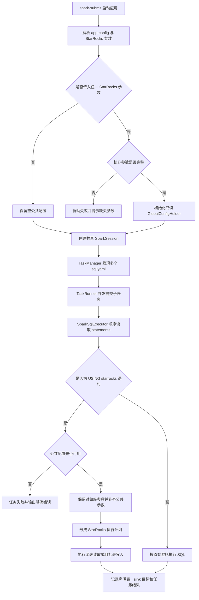
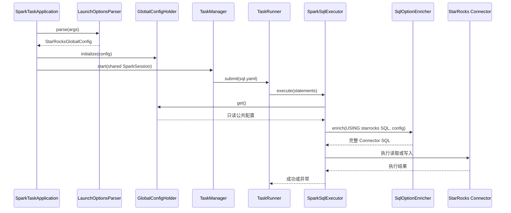

# TaskPlugin-Spark 对接 StarRocks 读写能力需求分析说明书

## 1. 项目背景

TaskPlugin-Spark 已形成以 Spark SQL 为核心的配置化任务执行框架，支持单任务执行和宿主式多任务执行。在宿主式多任务模式下，一个 Spark Application 读取应用级 `app-config.yaml`，发现任务目录中的多个 `sql.yaml`，由 `TaskManager` 调度多个 `TaskRunner` 并发执行，所有子任务共享同一个 SparkSession。

随着业务数据进入 StarRocks，需要在保持现有任务组织方式和执行链路的前提下补充 StarRocks 读取与写入能力。若由每个任务自行维护连接地址、账号、密码和 Connector 参数，将产生以下问题：

- 公共连接配置散落在多个 `sql.yaml` 或任务配置文件中，维护成本高；
- 密码等敏感信息重复出现，存在泄露风险；
- 多任务连接参数可能不一致，容易连接到错误环境；
- 修改集群地址或公共参数时，需要逐个修改任务；
- StarRocks Connector SQL 参数较多，业务 SQL 编写复杂且容易遗漏；
- 并发子任务缺少统一的连接配置初始化和只读约束。

因此，本项目采用“宿主式多任务执行 + 平台级公共配置 + 启动参数注入 + SQL 对象级参数声明 + 执行前自动补参”的方案。平台负责公共连接参数，业务任务仅声明数据库、物理表和计算逻辑，执行器在提交 SQL 前组合完整的 StarRocks Connector 配置。

## 2. 需求目标

本项目目标如下：

1. 在 TaskPlugin-Spark 宿主式多任务模式下实现 StarRocks 读取和写入能力。
2. 复用 `SparkTaskApplication -> TaskManager -> TaskRunner -> SparkSqlExecutor` 现有执行链路，不新建独立运行框架。
3. 将 StarRocks 公共连接参数统一为应用级配置，并在 Spark Application 启动时注入。
4. 保证公共配置在子任务启动前完成初始化，运行期间只读且所有子线程一致。
5. 业务 `sql.yaml` 仅声明 `database`、`table` 等对象级参数，不重复书写公共连接信息。
6. 自动识别 `USING starrocks` 语句，在执行前补齐并规范化 Connector 参数。
7. 支持在同一个 Spark Application 内并发执行多个 StarRocks 读写任务，同时允许与非 StarRocks SQL 任务混合运行。
8. 对参数缺失、配置冲突和未初始化等异常进行提前校验并输出明确错误。
9. 保持已有 SQL 顺序执行、临时对象隔离、任务生命周期和非 StarRocks 链路不变。
10. 通过执行计划和目标表日志提升多线程场景下的可观测性。

## 3. 项目已有能力

需求提出前，项目已有能力如下：

| 已有能力 | 能力说明 | 本需求复用方式 |
|---|---|---|
| Spark 应用入口 | `SparkTaskApplication` 可解析任务或应用配置并创建 SparkSession | 增加 StarRocks 启动参数解析和全局配置初始化 |
| 宿主式多任务 | 一个应用可发现并调度多个 `sql.yaml` | 每个 StarRocks 任务继续作为独立子任务运行 |
| 并发调度 | `TaskManager` 支持线程池、队列、失败策略和任务状态管理 | 保持调度模型，不按数据源重新拆分进程 |
| 子任务执行 | `TaskRunner` 可为每个任务构造上下文并调用 SQL 执行器 | 通过应用级持有器读取同一份 StarRocks 配置 |
| SQL YAML | `sql.yaml` 使用 `statements` 数组描述按顺序执行的 SQL | StarRocks DDL、计算 SQL 和 `INSERT` 沿用现有结构 |
| Spark SQL 执行 | `SparkSqlExecutor` 可解析并执行 DDL/DML | 在真正执行前增加 StarRocks 识别和公共参数补齐 |
| 临时对象隔离 | 多线程任务已有临时表/视图命名隔离机制 | 继续防止不同子任务的中间对象冲突 |
| 共享 SparkSession | 多个任务可复用同一 SparkSession | 多个 StarRocks 任务共享连接配置并并发执行 |

现有能力尚不能直接满足 StarRocks 接入：

| 能力缺口 | 直接影响 |
|---|---|
| 无应用级 StarRocks 公共配置模型 | 连接参数无法集中管理和复用 |
| 无启动参数解析及完整性校验 | 配置错误可能在任务运行阶段才暴露 |
| 无 StarRocks SQL 识别和补参 | 业务 SQL 必须重复声明全部 Connector 参数 |
| 无公共参数覆盖规则 | SQL 内配置与平台配置冲突时行为不确定 |
| 无 StarRocks sink 识别日志 | 并发写入时难以确认各子任务的目标表 |

## 4. 范围说明

### 4.1 本期范围

本期包括：

- 宿主式多任务模式下的 StarRocks 读取和写入；
- StarRocks 应用级公共配置对象及进程级只读持有器；
- `spark-submit` 应用参数的解析、完整性校验和脱敏日志；
- 通过重复的 `--starrocks-option key=value` 传递附加公共参数；
- `sql.yaml` 中基于 Spark SQL `USING starrocks` 的对象声明；
- 自动识别 StarRocks Connector DDL，并补齐公共连接参数；
- 将 `database` 与 `table` 规范化为 Connector 表标识；
- 公共连接参数与 SQL 参数的合并及冲突覆盖规则；
- StarRocks 源表读取、目标表声明及 `INSERT INTO`/`INSERT OVERWRITE TABLE` 目标识别；
- StarRocks 执行计划和 sink 目标表日志；
- 多个 StarRocks 子任务共享公共配置并发执行；
- StarRocks 任务与 HDFS、普通 Spark SQL 任务在同一进程内混合运行；
- 对现有任务调度、SQL 顺序执行和临时对象隔离的回归兼容。

### 4.2 非本期范围

本期不包括：

- 为每个 `sql.yaml` 单独配置不同 StarRocks 集群；
- 运行期间动态切换或热更新 StarRocks 公共连接配置；
- 引入任务级 `config.yaml` 承载 StarRocks 参数；
- 逻辑表名、`table-map` 或统一元数据映射层；
- 自动创建或变更 StarRocks 物理表结构；
- StarRocks 账号、密码的独立密钥管理系统建设；
- 调度系统参数透传协议本身的改造；
- 对其他数据源进行统一 Connector 抽象；
- 对任意非标准 SQL 方言进行通用语法解析和改写；
- 跨 Spark Application 的连接池或公共配置共享。

## 5. 功能需求

### 5.1 功能需求清单

| 编号 | 功能名称 | 需求说明 | 优先级 |
|---|---|---|---|
| FR-01 | 启动参数解析 | 识别 StarRocks 核心参数和可重复附加参数，并生成应用级配置对象 | P0 |
| FR-02 | 参数完整性校验 | 未传任何 StarRocks 参数时允许纯非 StarRocks 任务运行；传入部分核心参数时启动失败 | P0 |
| FR-03 | 公共配置初始化 | 在 `TaskManager.start()` 前完成全局配置初始化 | P0 |
| FR-04 | 只读共享 | 配置初始化后不可被子线程修改，所有子线程读取同一实例 | P0 |
| FR-05 | SQL 任务约定 | 每个 `sql.yaml` 直接声明 StarRocks 物理库表，不新增任务级配置或映射层 | P0 |
| FR-06 | StarRocks SQL 识别 | 识别包含 `USING starrocks` 的语句，非 StarRocks SQL 保持原样 | P0 |
| FR-07 | Connector 参数补齐 | 将全局配置转换为官方 Connector 参数并合并到 SQL `OPTIONS` | P0 |
| FR-08 | 参数冲突处理 | 公共连接类参数以应用启动参数为准，对象级参数由 `sql.yaml` 声明 | P0 |
| FR-09 | 读链路 | 支持 StarRocks 源表 DDL、临时视图计算及后续查询 | P0 |
| FR-10 | 写链路 | 支持 StarRocks 目标表 DDL 和 `INSERT INTO`/`INSERT OVERWRITE TABLE` 写入 | P0 |
| FR-11 | 执行计划识别 | 执行前识别已声明的 StarRocks 表和实际 sink 目标，并记录日志 | P1 |
| FR-12 | 并发执行 | 多个子任务可并发使用同一配置和 SparkSession，临时对象保持隔离 | P0 |
| FR-13 | 混合任务兼容 | 非 StarRocks SQL 不补参、不改变执行结果，可与 StarRocks 任务混跑 | P0 |
| FR-14 | 安全日志 | 密码不得以明文进入普通日志，配置摘要必须脱敏 | P0 |
| FR-15 | 生命周期清理 | 应用关闭时清理进程级配置持有器，避免同 JVM 重复调用残留旧配置 | P1 |

### 5.2 公共配置规则

| 场景 | 处理规则 |
|---|---|
| 未传任何 StarRocks 参数 | 返回空配置，允许纯 HDFS/普通 Spark SQL 任务启动 |
| 传入全部必需参数 | 初始化全局配置，StarRocks SQL 可执行 |
| 仅传入部分必需参数 | 启动阶段 fail fast，并列出缺失参数 |
| 同一附加参数重复传入 | 后传值覆盖先传值 |
| SQL 内重复声明公共连接参数 | 应用启动参数对应的公共值覆盖 SQL 值 |
| SQL 仅声明 `database`、`table` | 合并为 Connector 所需的 `starrocks.table.identifier` |
| 应用未初始化配置但执行 StarRocks SQL | 执行器明确报错，不把不完整 SQL 提交到 Spark |

### 5.3 SQL 参数职责边界

| 参数类别 | 维护位置 | 示例 |
|---|---|---|
| 应用运行参数 | `app-config.yaml` | Spark 资源、线程池、任务发现路径 |
| StarRocks 公共连接参数 | Spark Application 启动参数 | JDBC URL、FE HTTP URL、用户名、密码 |
| 附加公共 Connector 参数 | `--starrocks-option key=value` | 连接超时、批量参数等 |
| 对象级参数 | `sql.yaml` | `database`、`table` 及当前对象专属 options |
| 计算逻辑 | `sql.yaml` | 临时视图、查询、聚合、`INSERT INTO` |

## 6. 业务流程

### 6.1 总体业务流程



### 6.2 StarRocks SQL 执行交互



### 6.3 读链路

1. 子任务在 `sql.yaml` 中声明 StarRocks 源表，仅填写 `database` 和 `table`。
2. 执行器识别 `USING starrocks`，获取进程级公共配置。
3. 执行器补齐 JDBC、FE HTTP、用户和密码等 Connector 参数。
4. Spark 创建 StarRocks 表对象，后续 SQL 基于该表完成关联、过滤或聚合。
5. 中间临时视图继续使用项目已有的任务级隔离机制。

### 6.4 写链路

1. 子任务声明 StarRocks 目标表对象。
2. 执行器补齐目标表 DDL 的公共 Connector 参数。
3. 语句分析器收集当前任务已声明的 StarRocks 表。
4. 执行 `INSERT INTO` 或 `INSERT OVERWRITE TABLE` 前，识别目标是否为 StarRocks sink。
5. 日志记录 taskId、runId 和实际 sink 目标，随后由 Spark Connector 完成写入。

## 7. 接口

### 7.1 应用启动接口

示例：

```bash
spark-submit \
  --class com.taskplugin.spark.SparkTaskApplication \
  task-plugin-spark.jar \
  --app-config hdfs:///task-plugin/app-config.yaml \
  --starrocks-jdbc-url jdbc:mysql://fe-host:9030 \
  --starrocks-fe-http-url fe-host:8030 \
  --starrocks-username task_user \
  --starrocks-password '******' \
  --starrocks-option sink.properties.format=json
```

| 参数 | 必填规则 | 说明 |
|---|---|---|
| `--app-config` | 宿主式多任务必填 | 应用、Spark、线程池和任务发现配置路径 |
| `--starrocks-jdbc-url` | 使用 StarRocks 时必填 | StarRocks FE JDBC 地址 |
| `--starrocks-fe-http-url` | 与 `--starrocks-load-url` 至少提供一个 | Connector 使用的 FE HTTP 地址 |
| `--starrocks-load-url` | 可选兼容参数 | 未提供 FE HTTP 地址时可作为有效 HTTP 地址 |
| `--starrocks-username` | 使用 StarRocks 时必填 | 公共访问账号 |
| `--starrocks-password` | 使用 StarRocks 时必须显式提供 | 公共访问密码；允许空字符串但参数不能缺失 |
| `--starrocks-option key=value` | 否，可重复 | 附加公共 Connector 参数；格式非法时启动失败 |

### 7.2 `sql.yaml` 接口

读取示例：

```yaml
statements:
  - type: "DDL"
    sql: |
      CREATE TABLE dwd_order
      USING starrocks
      OPTIONS (
        "database" = "demo",
        "table" = "dwd_order"
      )

  - type: "DML"
    sql: |
      CREATE TEMP VIEW valid_order AS
      SELECT * FROM dwd_order WHERE order_status = 'VALID'
```

写入示例：

```yaml
statements:
  - type: "DDL"
    sql: |
      CREATE TABLE ads_order_summary
      USING starrocks
      OPTIONS (
        "database" = "demo",
        "table" = "ads_order_summary"
      )

  - type: "DML"
    sql: |
      INSERT INTO ads_order_summary
      SELECT * FROM valid_order
```

接口约束：

| 项目 | 约束 |
|---|---|
| YAML 结构 | 沿用现有 `statements` 数组，不增加新的 schema |
| 对象标识 | 业务任务直接声明物理 `database` 和 `table` |
| 公共参数 | 不要求在 SQL 中重复书写，由执行器统一注入 |
| 参数优先级 | 启动参数对应的公共连接配置优先于 SQL 中同类配置 |
| SQL 顺序 | 严格按 `statements` 顺序执行，先声明对象再查询或写入 |
| 非 StarRocks SQL | 原样进入既有执行链路 |
| 临时对象 | 沿用已有隔离改写规则，避免多线程重名 |

### 7.3 Connector 参数映射接口

| 输入配置 | 注入的 Connector 参数 |
|---|---|
| `--starrocks-jdbc-url` | `starrocks.fe.jdbc.url` |
| `--starrocks-fe-http-url` 或有效 `load-url` | `starrocks.fe.http.url` |
| `--starrocks-username` | `starrocks.user` |
| `--starrocks-password` | `starrocks.password` |
| SQL 中的 `database` + `table` | `starrocks.table.identifier=<database>.<table>` |
| `--starrocks-option key=value` | 规范化后按 key 注入 Connector `OPTIONS` |

### 7.4 内部组件接口

| 组件 | 输入 | 输出 | 职责 |
|---|---|---|---|
| `StarRocksLaunchOptionsParser` | 应用启动参数 | `StarRocksGlobalConfig` | 解析参数、校验完整性和附加项格式 |
| `StarRocksGlobalConfig` | 核心字段和 options | 只读配置、Connector options | 保存公共参数并提供脱敏摘要 |
| `StarRocksGlobalConfigHolder` | 已校验配置 | 进程级共享实例 | 在所有子任务启动前完成初始化 |
| `StarRocksSqlOptionEnricher` | 原始 SQL、全局配置 | 完整 StarRocks SQL | 识别、规范化、合并和渲染 `OPTIONS` |
| `StarRocksStatementInspector` | 当前任务语句列表 | 声明表和 sink 目标集合 | 生成执行计划并辅助写入日志 |
| `SparkSqlExecutor` | `sql.yaml` 语句 | SQL 执行结果 | 在执行前调用补参和语句分析能力 |

## 8. 验收标准

| 编号 | 验收项 | 通过标准 | 建议验证方式 |
|---|---|---|---|
| AC-01 | 完整参数解析 | 完整核心参数可生成已配置的全局对象，附加参数可重复解析 | 参数解析单元测试 |
| AC-02 | 部分参数拦截 | 只传部分核心参数时，应用启动失败并列出缺失项 | 参数缺失测试 |
| AC-03 | 非 StarRocks 兼容 | 未传 StarRocks 参数时，纯 HDFS/普通 Spark SQL 任务仍可启动 | 回归测试 |
| AC-04 | 初始化时序 | `TaskManager.start()` 前全局配置已可读 | 生命周期测试 |
| AC-05 | 配置只读共享 | 多个子线程获得的配置内容一致，运行期间不可修改 | 并发测试 |
| AC-06 | SQL 识别 | `USING starrocks` 可识别，其他 SQL 原样返回 | SQL 识别单元测试 |
| AC-07 | 参数补齐 | 仅声明 `database/table` 的 DDL 可得到完整 Connector 参数 | SQL 增强测试 |
| AC-08 | 冲突优先级 | SQL 内重复公共参数时，最终使用应用启动参数值 | 冲突合并测试 |
| AC-09 | 表标识规范化 | `database` 与 `table` 正确合并为官方表标识 | SQL 增强测试 |
| AC-10 | 读链路 | 一个 `sql.yaml` 可读取 StarRocks 表并完成后续计算 | 集成测试 |
| AC-11 | 写链路 | 目标表声明和 `INSERT INTO` 可完成 StarRocks 写入 | 集成测试 |
| AC-12 | sink 识别 | 能识别 `INSERT INTO` 和 `INSERT OVERWRITE TABLE` 命中的 StarRocks 目标 | 语句分析测试 |
| AC-13 | 并发读写 | 一个应用内多个 `sql.yaml` 可并发完成 StarRocks 读写 | 端到端并发测试 |
| AC-14 | 混合运行 | StarRocks 与非 StarRocks 子任务可在同一应用内执行，互不改写 | 混合场景测试 |
| AC-15 | 临时对象隔离 | 多任务使用相同临时对象逻辑名时，不发生相互覆盖 | 并发隔离测试 |
| AC-16 | 未初始化错误 | 检测到 StarRocks SQL 但公共配置为空时，任务明确失败 | 异常路径测试 |
| AC-17 | 日志安全 | 普通日志不出现明文密码，摘要中密码已脱敏 | 日志检查 |
| AC-18 | 执行可观测性 | Driver 日志可定位子任务声明的 StarRocks 表和实际 sink 目标 | 端到端日志检查 |
| AC-19 | 生命周期清理 | 应用关闭后持有器清空，同 JVM 再次调用不继承旧配置 | 生命周期单元测试 |

## 9. 风险与约束

| 类型 | 风险或约束 | 影响 | 应对措施 |
|---|---|---|---|
| 集群隔离 | 同一 Spark Application 只支持一套公共 StarRocks 配置 | 不同集群任务不能在同一进程运行 | 按 StarRocks 集群拆分 Spark Application |
| 配置安全 | 密码通过应用参数传入，可能被不当记录 | 存在敏感信息泄露风险 | 使用调度平台密文变量或凭据注入；日志统一脱敏；限制进程和提交记录访问权限 |
| 并发 | 多任务共享 SparkSession 和全局配置 | 临时对象或任务上下文可能相互影响 | 保留临时对象隔离，配置对象初始化后不可变，执行日志带 taskId/runId |
| 参数覆盖 | SQL 内公共参数被平台参数覆盖 | 任务编写者可能误判最终连接目标 | 明确参数优先级，日志输出脱敏后的有效配置摘要 |
| SQL 解析 | 第一版面向标准 `USING starrocks` 和 `OPTIONS` 写法 | 非标准格式、复杂注释或特殊转义可能无法正确增强 | 提供统一 SQL 模板；补充边界测试；必要时升级为语法树解析 |
| Connector 依赖 | StarRocks Connector 与 Spark/Scala 版本必须匹配 | 版本不匹配会导致编译或运行失败 | 固化依赖版本，在目标环境执行兼容性验证 |
| 目标表治理 | 框架不负责创建和变更 StarRocks 物理表 | 表不存在或 schema 不匹配会导致任务失败 | 上线前完成表结构校验和变更评审 |
| 写入语义 | 最终一致性、幂等性由 Connector 和目标表模型决定 | 重试可能造成重复或覆盖 | 根据主键/明细模型设计幂等策略，并明确任务重试规则 |
| 连接容量 | 多子任务并发访问同一 StarRocks 集群 | 可能造成 FE/BE 或网络压力 | 通过线程池控制并发，配置合理的批量和超时参数，监控集群负载 |
| 故障传播 | 公共配置错误会影响进程内全部 StarRocks 子任务 | 多任务同时失败 | 启动阶段 fail fast，执行前再次校验，错误信息明确列出缺失项 |
| 范围约束 | 不支持任务级集群切换、表映射和热更新 | 灵活性受限 | 作为后续独立需求评估，避免在本期扩大职责边界 |
| 兼容性 | StarRocks 增强不得改写普通 Spark SQL | 可能导致原有 HDFS 任务回归 | 仅对检测到 `USING starrocks` 的语句启用增强，并执行回归测试 |
