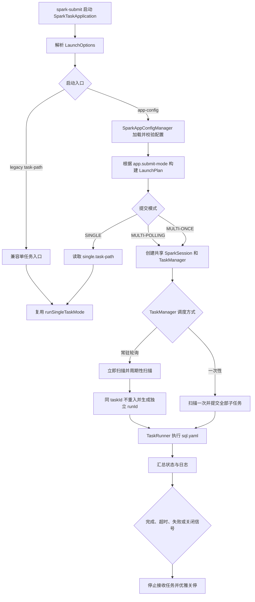
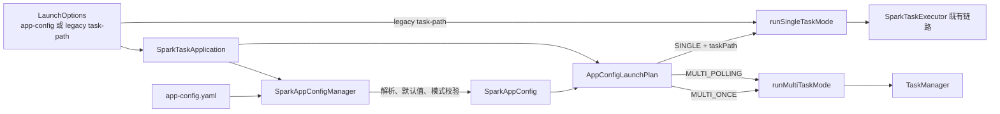
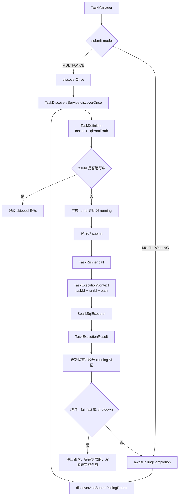

# TaskPlugin-Spark 统一 app-config 提交模式开发模块设计文档

## 一、流程概述

### 1.1 业务背景

TaskPlugin-Spark 原有两套应用提交协议：单任务通过 `--task-path` 指向任务目录，多任务通过 `--app-config` 指向宿主应用配置。两套入口在调度参数、配置文件结构和执行路径上存在差异，调度侧需要根据任务类型拼装不同命令，开发侧也需要分别维护单任务与多任务的启动逻辑。

本次开发将提交协议统一为 `--app-config`，由 `app.submit-mode` 决定运行形态，并继续保留 `--task-path` 作为兼容入口。统一后的三种运行形态为：

| 提交模式 | 运行形态 | 核心执行语义 |
|---|---|---|
| `SINGLE` | 单应用单任务 | 从 `single.task-path` 定位旧任务目录，复用既有单任务执行器 |
| `MULTI-ONCE` | 单应用多任务一次性 | 扫描一次任务目录，并发执行全部匹配的 SQL 子任务，完成后收敛退出 |
| `MULTI-POLLING` | 单应用多任务常驻轮询 | 启动后立即扫描，并按轮询间隔重复发现和提交任务，同一任务禁止并发重入 |

开发工作的重点不是新增一套 SQL 执行引擎，而是建立统一配置模型和启动分派机制，并扩展现有多任务调度器，使一次性执行与常驻轮询共享任务发现、线程池和 SQL 运行时能力。

### 1.2 核心业务流程

核心流程遵循以下顺序：

1. 应用入口只负责参数解析、配置加载和运行模式分派。
2. 配置管理器负责字段解析、默认值填充和模式级校验。
3. `SINGLE` 模式复用既有 `SparkTaskExecutor`，避免重复实现。
4. 两种多任务模式共享 `TaskManager`；区别仅在发现次数、退出条件和同任务重入控制。
5. 每个实际运行实例通过 `runId` 与稳定 `taskId` 区分。
6. 外部关闭、最大运行时长或 fail-fast 均由 `TaskManager` 统一收敛。

### 1.3 功能模块划分

| 模块 | 模块职责 | 主要组件 |
|---|---|---|
| 统一配置与提交分派模块 | 定义配置模型、解析 `app-config.yaml`、校验模式字段、构建启动计划并兼容旧入口 | `SparkAppConfig`、`SparkAppConfigManager`、`SparkTaskApplication` |
| 多模式调度与运行控制模块 | 执行任务发现、一次性调度、常驻轮询、不重入控制、运行实例标识、状态日志和优雅关停 | `TaskDiscoveryService`、`TaskManager`、`TaskDefinition`、`TaskExecutionContext`、`TaskRunner`、`TaskRuntimeStatus`、`SparkSqlExecutor` |

两个模块之间以 `SparkAppConfig` 为配置契约：提交分派模块完成配置解析并创建运行计划，多模式调度模块只消费已校验的配置，不再解释原始 YAML。

## 二、统一配置与提交分派模块

### 2.1 概述

该模块负责把原有两套启动协议收敛为配置驱动的统一入口。核心设计是新增 `app.submit-mode` 和 `single.task-path`，将模式选择从启动命令下沉到 `app-config.yaml`，并通过 `AppConfigLaunchPlan` 将配置值转换为明确的运行分支。

模块同时承担兼容职责：旧 `--task-path` 入口继续直接进入原单任务链路；新 `--app-config + SINGLE` 则从配置中解析任务路径后复用同一执行方法。这样可以先统一调度协议，再逐步下线旧入口，不要求业务任务一次性完成迁移。

模块内部包含三个层次：

| 层次 | 职责 |
|---|---|
| 配置模型层 | 定义提交模式常量、应用配置、单任务配置、Spark/调度/发现配置结构 |
| 配置解析层 | 从 HDFS YAML 读取配置，完成变量替换、默认值、白名单和模式级必填校验 |
| 应用分派层 | 解析命令行入口，构建启动计划，并调用 SINGLE 或多任务运行链路 |

### 2.2 变更文件

#### 生产代码

| 变更类型 | 文件 |
|---|---|
| 修改 | `task-plugin-spark/src/main/java/com/taskplugin/spark/app/SparkAppConfig.java` |
| 修改 | `task-plugin-spark/src/main/java/com/taskplugin/spark/app/SparkAppConfigManager.java` |
| 修改 | `task-plugin-spark/src/main/java/com/taskplugin/spark/SparkTaskApplication.java` |

#### 单元测试与测试资源

| 变更类型 | 文件或目录 |
|---|---|
| 新增 | `task-plugin-spark/src/test/java/com/taskplugin/spark/app/SparkAppConfigManagerTest.java` |
| 新增 | `task-plugin-spark/src/test/java/com/taskplugin/spark/SparkTaskApplicationTest.java` |
| 新增 | `task-plugin-spark/src/test/resources/app-config/single.yaml` |
| 新增 | `task-plugin-spark/src/test/resources/app-config/multi-once.yaml` |
| 新增 | `task-plugin-spark/src/test/resources/app-config/multi-polling-default-interval.yaml` |
| 新增 | `task-plugin-spark/src/test/resources/app-config/multi-once-with-legacy-discovery-mode.yaml` |
| 新增 | `task-plugin-spark/src/test/resources/app-config/missing-submit-mode.yaml` |
| 新增 | `task-plugin-spark/src/test/resources/app-config/single-missing-task-path.yaml` |
| 新增 | `task-plugin-spark/src/test/resources/app-config/multi-once-missing-task-root.yaml` |

#### 示例与说明

| 变更类型 | 文件或目录 |
|---|---|
| 新增 | `examples/spark/simple-batch-task/app-config.yaml` |
| 修改 | `examples/spark/simple-batch-multithread-task/app-config.yaml` |
| 修改 | `examples/spark/starrocks-multithread-task/app-config.yaml` |
| 新增 | `examples/spark/single-starrocks-task/` 中的配置、SQL、初始化脚本和说明 |
| 修改 | `doc/SparkAppConfigGuidance.md` |

### 2.3 文件变更点概述

| 文件 | 主要变更点 |
|---|---|
| `SparkAppConfig.java` | 新增 `SUBMIT_MODE_SINGLE`、`SUBMIT_MODE_MULTI_ONCE`、`SUBMIT_MODE_MULTI_POLLING`；在 `AppConfig` 中增加 `submitMode`；新增 `SingleConfig` 承载 `single.task-path`；从 `DiscoveryConfig` 移除 `mode`；提供提交模式和单任务路径的便捷访问方法 |
| `SparkAppConfigManager.java` | 解析并统一大写化 `app.submit-mode`；解析 `single.task-path`；按模式执行必填校验；为 discovery pattern、polling interval 和 polling 最大运行时长填充默认值；废弃 `discovery.mode`；提供基于文本的加载入口便于测试 |
| `SparkTaskApplication.java` | 新增 `runAppConfigMode`、`loadResolvedAppConfig` 和 `buildAppConfigLaunchPlan`；将 app-config 入口分派到 `SINGLE`、`MULTI-ONCE`、`MULTI-POLLING`；保留 legacy `--task-path`；将两种多任务模式统一交给 `TaskManager` |
| `SparkAppConfigManagerTest.java` | 覆盖三种模式解析、默认值、缺失字段、未知模式和遗留 `discovery.mode` 兼容行为 |
| `SparkTaskApplicationTest.java` | 覆盖运行计划构建、模式名归一、必填路径校验和旧入口解析 |
| 测试 YAML | 分别提供正常、缺失字段、默认值和遗留字段场景，避免测试内拼接大段 YAML |
| 示例配置 | 将多任务示例迁移到 `app.submit-mode=MULTI-ONCE`，新增统一入口的 SINGLE 示例 |
| `SparkAppConfigGuidance.md` | 说明三种模式、字段职责、默认值及 `discovery.mode` 废弃策略 |

配置校验的主要规则如下：

| 模式 | 必填字段 | 关键默认值 |
|---|---|---|
| `SINGLE` | `app.submit-mode`、`single.task-path` | `app.runtime-mode=BATCH` |
| `MULTI-ONCE` | `app.submit-mode`、`discovery.task-root-path` | `discovery.pattern=**/sql**.yaml` |
| `MULTI-POLLING` | `app.submit-mode`、`discovery.task-root-path` | `polling-interval=60s`、`max-running-duration=6h` |

### 2.4 关系图

### 2.5 影响分析

| 影响维度 | 影响说明 | 控制措施 |
|---|---|---|
| 调度接口 | 新任务统一使用 `--app-config`，调度侧无需区分单任务与多任务命令模板 | 保留 `--task-path` 兼容入口，分阶段迁移 |
| 配置兼容 | `app.submit-mode` 成为必填字段，`discovery.mode` 不再参与行为判断 | 提供迁移示例；遗留 `discovery.mode` 可被忽略而不阻塞解析 |
| SINGLE 行为 | 新入口最终仍调用旧单任务执行方法 | 不改 `SparkTaskExecutor` 内部执行语义，降低回归范围 |
| 多任务行为 | 两种多任务模式共享入口和 SparkSession 初始化 | 模式差异下沉到 `TaskManager`，避免入口重复实现 |
| 错误边界 | 缺少模式、任务路径或发现根目录时会提前失败 | 由配置管理器和启动计划双层校验，错误信息指向具体字段 |
| SQL 能力 | 提交模式只决定调度方式，不应切分 SQL 功能 | 各模式复用同一 `SparkSqlExecutor` 运行时能力 |
| 配置热更新 | app-config 仅在应用启动时读取一次 | 配置变更通过重新提交应用生效，文档明确该约束 |
| 安全与共享状态 | StarRocks 等共享运行时配置需要在模式分派前初始化 | 共享初始化链路与 submit-mode 解耦，关闭时清理 Holder |

## 三、多模式调度与运行控制模块

### 3.1 概述

该模块在既有一次性多任务调度器上增加常驻轮询能力，并统一运行实例标识、状态日志和关停策略。`TaskManager` 是核心协调者：它根据 `app.submit-mode` 选择一次发现或周期发现，通过线程池提交 `TaskRunner`，并负责最大运行时长、fail-fast 和 shutdown hook 下的任务收敛。

`MULTI-POLLING` 使用稳定 `taskId` 表示任务定义，使用动态 `runId` 表示某次实际运行。调度器维护运行中的 `taskId` 集合；上一轮尚未结束时，本轮直接跳过同任务，不排队，也不提交重复实例。任务完成后释放标记，下一轮可重新运行。

该模块不复制 SQL 执行逻辑。`TaskRunner` 将 `taskId`、`runId` 和 `sqlYamlPath` 组装为 `TaskExecutionContext`，继续调用 `SparkSqlExecutor` 执行任务。

### 3.2 变更文件

#### 生产代码

| 变更类型 | 文件 |
|---|---|
| 修改 | `task-plugin-spark/src/main/java/com/taskplugin/spark/app/TaskDiscoveryService.java` |
| 修改 | `task-plugin-spark/src/main/java/com/taskplugin/spark/app/TaskManager.java` |
| 修改 | `task-plugin-spark/src/main/java/com/taskplugin/spark/app/TaskDefinition.java` |
| 修改 | `task-plugin-spark/src/main/java/com/taskplugin/spark/app/TaskExecutionContext.java` |
| 修改 | `task-plugin-spark/src/main/java/com/taskplugin/spark/app/TaskRunner.java` |
| 修改 | `task-plugin-spark/src/main/java/com/taskplugin/spark/app/TaskRuntimeStatus.java` |
| 修改 | `task-plugin-spark/src/main/java/com/taskplugin/spark/sql/SparkSqlExecutor.java` |

#### 测试代码

| 变更类型 | 文件 |
|---|---|
| 新增 | `task-plugin-spark/src/test/java/com/taskplugin/spark/app/TaskManagerTest.java` |
| 修改/回归 | `task-plugin-spark/src/test/java/com/taskplugin/spark/app/SparkAppConfigManagerTest.java` |
| 修改/回归 | `task-plugin-spark/src/test/java/com/taskplugin/spark/SparkTaskApplicationTest.java` |

### 3.3 文件变更点概述

| 文件 | 主要变更点 |
|---|---|
| `TaskDiscoveryService.java` | 发现逻辑只依赖 `task-root-path` 和 `pattern`；默认 pattern 与配置管理器统一；日志输出根路径、匹配规则和任务数量 |
| `TaskManager.java` | 保留一次性调度；新增启动即扫描和周期扫描；维护运行中 taskId；生成带时间戳和序列号的 runId；记录轮次、提交、跳过和完成计数；支持 fail-fast、最大运行时长和关闭信号下的收敛 |
| `TaskDefinition.java` | 新增 `runId`；保留旧构造器，一次性模式可继续以 `taskId` 作为 runId，减少调用方改动 |
| `TaskExecutionContext.java` | 新增 `runId` 并提供读取方法；保留旧构造方式以兼容既有测试和执行链路 |
| `TaskRunner.java` | 创建上下文时传递 taskId、runId、SQL 路径；开始、成功和失败日志增加 runId |
| `TaskRuntimeStatus.java` | 维持 `PENDING`、`RUNNING`、`SUCCEEDED`、`FAILED`、`CANCELLED`；不新增 `SKIPPED`，跳过行为使用指标与日志表达 |
| `SparkSqlExecutor.java` | 在任务上下文相关 SQL、StarRocks 补参和写入日志中增加 runId，不改变 SQL 执行顺序 |
| `TaskManagerTest.java` | 覆盖 runId 格式、不重入判断、完成后释放标记、模式默认退出行为和时长单位解析 |

调度模式的差异点如下：

| 行为 | `MULTI-ONCE` | `MULTI-POLLING` |
|---|---|---|
| 任务发现 | 扫描一次 | 启动立即扫描，之后周期扫描 |
| 同任务再次提交 | 不涉及下一轮 | 前一实例运行中则跳过 |
| runId | 兼容使用 taskId 或单次实例标识 | 每次实际提交生成新 runId |
| 全部任务完成后 | 默认退出 | 默认继续常驻 |
| 默认最大运行时长 | 由配置决定 | 未配置时 6 小时 |
| 子任务失败 | 遵循 fail-fast 配置 | 默认记录失败并继续轮询；fail-fast 时收敛退出 |

### 3.4 关系图

### 3.5 影响分析

| 影响维度 | 影响说明 | 控制措施 |
|---|---|---|
| 调度语义 | `MULTI-POLLING` 是定时触发，不是文件变更触发；每轮都可生成新实例 | 通过 taskId/runId 分离定义与实例，日志明确轮次 |
| 并发安全 | 同一任务重复并发会造成写入冲突或资源放大 | 使用运行中 taskId 集合做不重入控制，完成后在统一回调中释放 |
| 任务积压 | 任务执行时间超过轮询间隔时可能持续堆积 | 同任务未完成直接跳过，不进入队列 |
| 状态模型 | 未新增 `SKIPPED` 枚举 | 使用轮次日志和 skipped 计数表达，避免扩大状态兼容范围 |
| 可观测性 | 稳定 taskId 无法区分不同轮次 | 所有关键日志同时输出 taskId、runId 和 SQL 路径 |
| 资源使用 | 常驻应用可能长期占用 YARN 资源 | 支持最大运行时长和 dynamic allocation，默认 6 小时后收敛 |
| 关停 | 外部 kill 或 fail-fast 期间可能仍有任务运行 | 停止发现新任务，等待 `shutdown-grace-period`，超时后取消 |
| SQL 配置更新 | 常驻期间任务 SQL 可能变化 | 每次实际提交前重新读取当前 SQL 文件；已启动实例不受后续修改影响 |
| 共享 SparkSession | 子任务 SET 或临时对象可能影响其他任务 | Spark 级配置统一放到 app-config；业务 SQL 避免全局 SET，并遵循对象命名规范 |
| 兼容构造器 | 新增 runId 可能影响既有调用方 | `TaskDefinition` 和 `TaskExecutionContext` 保留旧构造器 |

## 四、测试建议

### 4.1 单元测试

| 测试对象 | 建议测试场景 | 核心断言 |
|---|---|---|
| `SparkAppConfigManagerTest` | 三种 submit-mode 正常解析 | 模式值、single 路径、discovery 路径正确进入配置模型 |
| `SparkAppConfigManagerTest` | 缺少 submit-mode、single 路径或发现根目录 | 配置阶段抛出指向具体字段的异常 |
| `SparkAppConfigManagerTest` | polling interval、pattern、最大运行时长未配置 | 分别得到 `60s`、`**/sql**.yaml`、`6h` 默认值 |
| `SparkAppConfigManagerTest` | 遗留 `discovery.mode` 存在 | 不参与模式判断，不破坏新配置解析 |
| `SparkTaskApplicationTest` | app-config 的三种模式 | 构建正确的 `AppConfigLaunchPlan` |
| `SparkTaskApplicationTest` | legacy `--task-path` | 仍解析为旧单任务入口 |
| `SparkTaskApplicationTest` | 小写模式和未知模式 | 小写归一成功；未知值明确失败 |
| `TaskManagerTest` | runId 连续生成 | 格式包含 taskId、毫秒时间和序列号，连续生成不重复 |
| `TaskManagerTest` | taskId 已在运行 | 本轮跳过且不向线程池重复提交 |
| `TaskManagerTest` | 任务完成或失败 | 运行中标记最终释放，下一轮允许再次提交 |
| `TaskManagerTest` | fail-fast 开关 | false 时继续调度，true 时触发收敛标记 |
| `TaskManagerTest` | 时长解析 | `ms`、`s`、`m`、`h`、`d` 和无单位秒值均正确换算 |
| `TaskRunner` 回归测试 | 上下文传递 | taskId、runId、sqlYamlPath 完整进入 SQL 执行上下文 |
| 关停测试 | shutdown 与宽限期 | 停止新任务；超时后取消未完成 Future；重复 shutdown 幂等 |

单元测试应尽量使用可控时钟、短轮询间隔和可注入的任务执行器，避免真实 sleep 和 Spark/YARN 依赖造成测试不稳定。

### 4.2 Beta 测试

Beta 测试应在可访问公司定制 Spark 依赖、HDFS 和 YARN 的环境执行。原实施记录未完成真实 HDFS/YARN/StarRocks 端到端验证，因此以下场景应作为上线前重点。

| 编号 | 场景 | 操作要点 | 通过标准 |
|---|---|---|---|
| B-01 | 新 SINGLE 入口 | 使用 `--app-config` 和 `submit-mode=SINGLE` 提交现有单任务 | 执行结果与旧 `--task-path` 一致 |
| B-02 | 旧入口兼容 | 使用原 `--task-path` 提交同一任务 | 能正常运行，日志标识兼容入口 |
| B-03 | MULTI-ONCE | 任务根目录放置多个 SQL 文件并一次性提交 | 每个任务执行一次，全部结束后应用退出 |
| B-04 | MULTI-POLLING 首轮 | 配置较短 polling interval 后启动 | 应用启动后无需等待间隔即完成首轮发现 |
| B-05 | 周期重复执行 | 保持同一 SQL 文件跨多个轮次运行 | 每轮产生不同 runId，taskId 保持稳定 |
| B-06 | 同任务不重入 | 构造执行时间大于轮询间隔的任务 | 上一实例运行时后续轮次跳过，不产生并发副本 |
| B-07 | SQL 动态更新 | 第一轮结束后修改 HDFS 上的 SQL 内容 | 下一轮读取新内容；已运行实例不受影响 |
| B-08 | 非 fail-fast 失败 | 一个子任务失败，配置 `fail-fast=false` | 失败被记录，应用继续轮询其他任务 |
| B-09 | fail-fast 失败 | 一个子任务失败，配置 `fail-fast=true` | 停止接收新任务并进入优雅关停 |
| B-10 | 最大运行时长 | 配置较短 `max-running-duration` | 到期后停止轮询并在宽限期内收敛 |
| B-11 | 外部关闭 | 在存在运行任务时发送终止信号 | shutdown hook 生效，日志包含等待与取消结果 |
| B-12 | 资源治理 | 开启 dynamic allocation 并观察空闲期 | Executor 数量可收缩，Driver 常驻资源符合预期 |
| B-13 | 日志追踪 | 并发执行多个任务和多个轮次 | 可按 taskId/runId 还原每个实例的发现、执行和结束链路 |
| B-14 | 混合 SQL 回归 | 同一应用执行普通 SQL、HDFS 和 StarRocks 任务 | 统一提交改造不改变既有 SQL 路由和执行结果 |

Beta 测试退出条件：三种提交模式均完成至少一次成功运行；不重入、失败策略和优雅关停场景均符合预期；Driver 日志不存在无法归属到 runId 的关键异常；应用退出后无线程池或 SparkSession 残留。

## 五、总结

本次开发通过 `SparkAppConfig`、`SparkAppConfigManager` 和 `SparkTaskApplication` 建立统一的配置与提交分派模块，再通过 `TaskManager` 扩展一次性与常驻轮询两种多任务调度语义。任务定义与运行实例使用 `taskId/runId` 分层标识，`TaskRunner` 和 `SparkSqlExecutor` 继续复用既有 SQL 执行能力。

开发结果将提交协议差异限制在入口和调度层，没有复制 SQL 执行器，也没有改变旧单任务内部逻辑。兼容入口、默认值、同任务不重入和优雅关停共同保证迁移过程可控。后续如增加新的提交模式，应继续通过运行计划和 `TaskManager` 扩展，避免在应用入口中堆叠业务执行逻辑。
